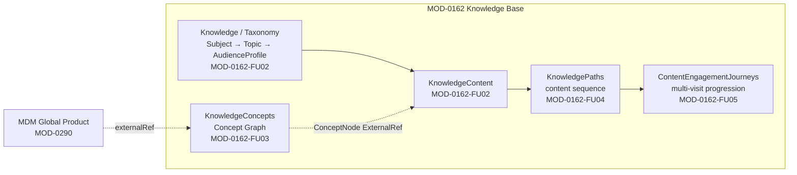
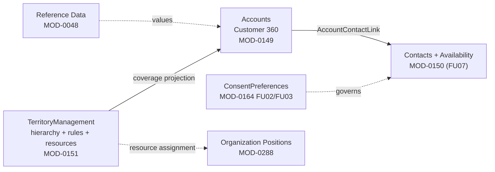
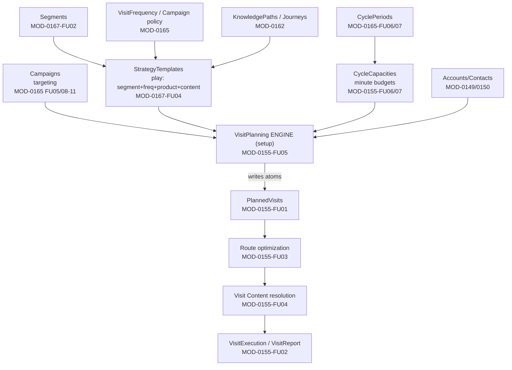
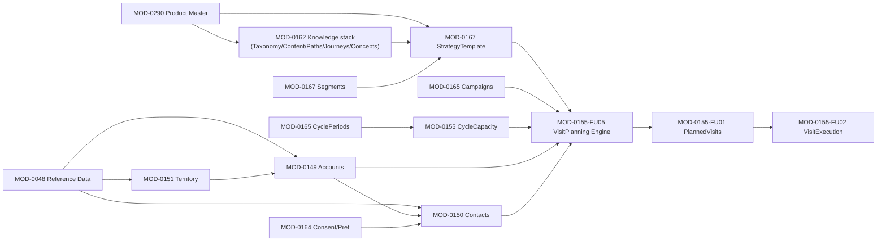

# CRM Pages → Domain / MOD Mapping & Workflow Map

**Repo:** `C:\Users\user\Desktop\ERP-vNext`
**Branch:** `feature/crm-integration-v2`
**Date:** 2026-08-30
**Method:** Read-only. Pages enumerated from `frontend/Diten.Web/Controllers/CRM/*.cs` (route attributes) + `frontend/Diten.Web/Views/CRM/<Area>/`; each backed by a controller under `services/Diten.CrmService/src/Diten.CrmService.Api/Controllers/CRM/`. Domain/MOD resolved by cross-referencing the XML-doc `MOD-0xxx FUyy` citations already present in every CRM controller against **Blueprint 8.1** (`docs/System Capability & Implementation Blueprint - master 8.1.xlsx`, sheet `Blueprint_Data`) and the module packs under `execution/domains/*/module-packs/`.

Every one of the 16 CRM controllers self-declares its MOD in its summary comment, and all 16 resolve to a blueprint 8.1 row. **No page came back `tanımlanamadı (undefined)`.** Two nuances (RBAC dev-fallback, nav gaps) are flagged in the notes column, not as undefined mappings.

---

## Blueprint 8.1 domain anchors (sheet `Blueprint_Data`)

| MOD | Domain / Landscape | Suite | Capability Group | Module Name |
|-----|--------------------|-------|------------------|-------------|
| MOD-0149 | 4) Enterprise Application Ecosystem | Commercial Suite (CRM + O2C) | CRM Core | Customer 360 / Account Hierarchy |
| MOD-0150 | 4) Enterprise Application Ecosystem | Commercial Suite (CRM + O2C) | CRM Core | Contact & Relationship Management |
| MOD-0151 | 4) Enterprise Application Ecosystem | Commercial Suite (CRM + O2C) | CRM Core | Territory Management |
| MOD-0155 | 4) Enterprise Application Ecosystem | Commercial Suite (CRM + O2C) | Sales | Field Sales / Visit Planning |
| MOD-0162 | 4) Enterprise Application Ecosystem | Commercial Suite (CRM + O2C) | Service | Knowledge Base |
| MOD-0164 | 4) Enterprise Application Ecosystem | Commercial Suite (CRM + O2C) | Marketing | Consent & Preference Management |
| MOD-0165 | 4) Enterprise Application Ecosystem | Commercial Suite (CRM + O2C) | Marketing | Campaign Management |
| MOD-0167 | 4) Enterprise Application Ecosystem | Commercial Suite (CRM + O2C) | Marketing | Segmentation / CDP |
| MOD-0048 | 2) Data, Knowledge & Intelligence | Data & Knowledge Plane | Master Data & Governance | Reference Data Management |
| MOD-0018 | 1) Platform & Shared Services | Identity, Access & Trust | Access & Authorization | RBAC / ABAC Authorization |
| MOD-0290 | 4) Enterprise Application Ecosystem | Master Data / Product Foundation | Product/Item/SKU | Product / Item / SKU Master |

MOD-0048 (reference values), MOD-0018 (permission keys), MOD-0290 (MDM global-product picker) are **cross-domain dependencies** consumed by the CRM pages, not CRM pages themselves.

---

## Page → MOD mapping table

All frontend routes are prefixed `/CRM/`. All pages sit in the **Commercial Suite (CRM + O2C)** domain (blueprint landscape *4) Enterprise Application Ecosystem*).

| # | Page (Controller) | Route | Capability Group | MOD number(s) | Status | Notes |
|---|-------------------|-------|------------------|---------------|--------|-------|
| 1 | Accounts | `/CRM/Accounts` | CRM Core | **MOD-0149** (Customer 360). Reads: MOD-0150 (related contacts/accounts FU03/FU04), MOD-0151 (territory coverage projection) | built | Lone true server-side DataTable (43K rows). Coverage + country/territory chips are read-only projections owned by MOD-0151. |
| 2 | Contacts | `/CRM/Contacts` | CRM Core | **MOD-0150** (Contact & Relationship Mgmt); incl. **FU07** availability, Import/Export tasks | built | Availability is a separate aggregate (`/CRM/Contacts/Availability`). Grid still client-side at 128K rows. |
| 3 | TerritoryManagement | `/CRM/TerritoryManagement` | CRM Core | **MOD-0151** (Territory Mgmt) — FU02 hierarchy, FU03 rules/preview, FU04 resource assignments, FU05A coverage, FU08 import/export | built | Positions replace former MOD-0048 role source (FU04 → MOD-0288/Organization). |
| 4 | ConsentPreferences | `/CRM/ConsentPreferences` | Marketing | **MOD-0164** — FU02 runtime (consent/preference), **FU03** admin UI | partial | UI is a consumer of the FU02 contract; documented FU02-contract gaps (preference ScopeType/ScopeId, generic consent Reason). Evidence sources cite MOD-0028/MOD-0029. |
| 5 | Knowledge | `/CRM/Knowledge` | Service (Knowledge Base) | **MOD-0162-FU02** (Knowledge Content + Subject/Topic/AudienceProfile taxonomy) | built | `Taxonomy.cshtml` companion surface. Segment picker intentionally not loaded (was pre-MOD-0167). |
| 6 | KnowledgePaths | `/CRM/KnowledgePaths` | Service (Knowledge Base) | **MOD-0162-FU04** (Knowledge Path / content sequence) | built | Embedded-steps aggregate; separate publish + freeze. |
| 7 | KnowledgeConcepts | `/CRM/KnowledgeConcepts` | Service (Knowledge Base) | **MOD-0162-FU03** (Concept Graph: types/nodes/relationships/chain templates) | partial | Uses DEV-ONLY RBAC fallback (`crm.territory.read` / `.model.manage`) pending MOD-0162-FU03-RBAC grant. ConceptNode ExternalRef = MDM global-product (MOD-0290). |
| 8 | ContentEngagementJourneys | `/CRM/ContentEngagementJourneys` | Service (Knowledge Base) | **MOD-0162-FU05** (Content Engagement Journey; multi-visit content progression FU01B) | built | Pins a published KnowledgePath; publish SoD, no engine. |
| 9 | Segments | `/CRM/Segments` | Marketing (Segmentation / CDP) | **MOD-0167-FU02** (Segment foundation: criteria/membership/TargetCustomer) | built | Consumes MOD-0164 consent, MOD-0149/0150/0151 pickers. |
| 10 | StrategyTemplates | `/CRM/StrategyTemplates` | Marketing (Segmentation / CDP) | **MOD-0167-FU04** (Strategy Template = Segment + frequency + product-mix + content playbook) | built | The "play": binds MOD-0167 segment + MOD-0165 frequency + MOD-0162 path/journey + MOD-0290 product→SKU%. |
| 11 | Campaigns | `/CRM/Campaigns` | Marketing (Campaign Mgmt) | **MOD-0165** — FU05 admin UI, FU08 cycle-period binding, FU09 scope mirror, FU10 multi-segment targeting, FU11 manual targeting | built | `Targeting.cshtml` is read-only; consumes MOD-0164 (consent snapshot/provenance), MOD-0165 cycle periods, MOD-0167 segments, MOD-0149/0150 manual targets. |
| 12 | CyclePeriods | `/CRM/CyclePeriods` | Marketing (Campaign Mgmt) | **MOD-0165-FU06/FU07** (Cycle Period + scope enrichment) | built | Not a plan-apply surface (applying a plan to a period = MOD-0155). No working-day computation here. |
| 13 | CycleCapacities | `/CRM/CycleCapacities` | Sales (Field Sales / Visit Planning) | **MOD-0155-FU06/FU07** (Cycle Capacity + monthly redesign) | built | 1:1 aggregate; TotalVisitNumber never persisted. Resolves WC country layer (needs `platform.working-calendar.override.read`). |
| 14 | PlannedVisits | `/CRM/PlannedVisits` | Sales (Field Sales / Visit Planning) | **MOD-0155-FU01** (Planned Visit atom) | built | Read-only pickers pass through MOD-0149/0150/0162 surfaces. |
| 15 | VisitPlanning | `/CRM/VisitPlanning` | Sales (Field Sales / Visit Planning) | **MOD-0155-FU05** (MicroTarget Visit Planning engine SETUP console) | built | Bespoke tenant-shell (D-UI=B). Apply writes FU01 atoms directly via UoW transaction. **Not yet in nav menu.** |
| 16 | VisitExecution (CrmVisitExecution) | `/CRM/VisitExecution` | Sales (Field Sales / Visit Planning) | **MOD-0155-FU02** (Visit Report EXECUTION calendar) | built | Immutable VisitReport aggregate; execution status lives only on VisitReport (FU01 atom stays `confirmed`). **Not yet in nav menu.** |

**Backing services (all present):** every page maps to a controller under `services/Diten.CrmService/src/Diten.CrmService.Api/Controllers/CRM/` — e.g. Accounts→`AccountController`, Contacts→`ContactController`+`ContactAvailabilityController`+`ImportExportController`, Territory→`TerritoryModels/Resources/Readiness`, Consent→`ConsentsController`+`PreferencesController`, Knowledge→`KnowledgeContents/Subjects/Topics/AudienceProfiles`, Concepts→`KnowledgeConceptTypes/Nodes/Relationships/ChainTemplates/Graph`, Journeys→`ContentEngagementJourneysController`, Segments→`SegmentsController`, StrategyTemplates→`StrategyTemplatesController`, Campaigns→`CampaignsController`, CyclePeriods→`CyclePeriodsController`, CycleCapacities→`CycleCapacitiesController`, PlannedVisits→`PlannedVisitsController`, VisitPlanning→`VisitPlanningController`+`RouteOptimizationController`+`VisitContentController`, VisitExecution→`VisitReportController`.

---

## Workflow map

The CRM surfaces form three spines that converge on the visit-planning engine. MOD numbers are on every node.

### Spine A — Knowledge stack (MOD-0162, "Service / Knowledge Base")

### Spine B — Master data (MOD-0151 → 0149 → 0150 + 0164)

### Spine C — Visit planning (targeting → engine → plan → execution)

### Full CRM system map

### Prose

1. **Master data first.** MOD-0151 Territory publishes the hierarchy and coverage rules; MOD-0149 Accounts bind to territory nodes (coverage is a read-only projection back onto the Account 360 page) and to MOD-0048 reference values. MOD-0150 Contacts hang off Accounts via `AccountContactLink`, carry FU07 availability as a separate aggregate, and are governed by MOD-0164 consent/preference.
2. **Knowledge is authored independently.** MOD-0162 builds Subject→Topic→AudienceProfile taxonomy → KnowledgeContent → KnowledgePath → ContentEngagementJourney, with the Concept Graph (FU03) cross-linking content to MDM global products (MOD-0290).
3. **Targeting binds the two.** MOD-0167 Segments select the "who"; StrategyTemplate (MOD-0167-FU04) is the play that binds a segment + MOD-0165 frequency policy + MOD-0162 content + MOD-0290 product mix. MOD-0165 Campaigns add cycle-period-bound, scope-aware, multi-segment/manual targeting.
4. **Capacity is bounded.** MOD-0165 CyclePeriods define the calendar window; MOD-0155 CycleCapacity turns that into per-rep minute budgets (resolving the platform Working Calendar).
5. **The engine converges everything.** MOD-0155-FU05 VisitPlanning consumes StrategyTemplate/Segment targeting + CycleCapacity + Account/Contact availability and **writes MOD-0155-FU01 PlannedVisit atoms directly**. Downstream: FU03 route optimization → FU04 content resolution → FU02 VisitExecution/VisitReport (the immutable execution record; execution status lives only on the report, the FU01 atom stays `confirmed`).

---

## Undefined / unmapped pages (`tanımlanamadı`)

**None.** All 16 CRM pages map to a concrete MOD present in both blueprint 8.1 (`Blueprint_Data`) and the module packs. Every controller self-declares its MOD in its XML-doc summary.

Two items to watch (mapped, but not fully wired):

- **KnowledgeConcepts (MOD-0162-FU03)** — runs on a DEV-ONLY RBAC fallback (`crm.territory.read` / `crm.territory.model.manage`) until `MOD-0162-FU03-RBAC` keys are granted. Mapping is not in doubt; the permission catalog entry is pending.
- **VisitPlanning (MOD-0155-FU05)** and **VisitExecution (MOD-0155-FU02)** — built and route-reachable but **not yet registered in the navigation menu** (follow-up F-NAV). Mapping is certain.
- **ConsentPreferences (MOD-0164)** — status *partial*: the FU03 admin UI is complete but sits on FU02-contract gaps (preference lacks ScopeType/ScopeId/IsRestrictive, consent lacks a generic Reason).
