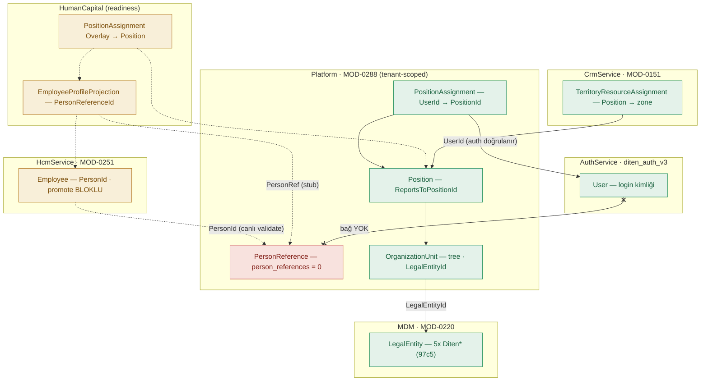
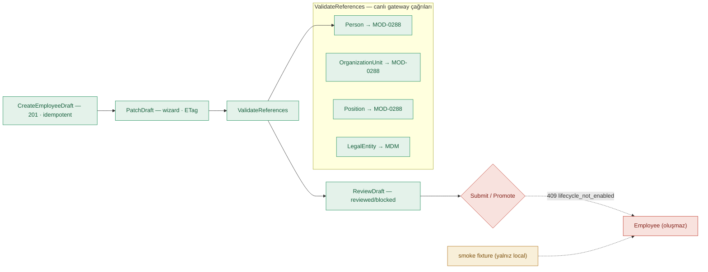
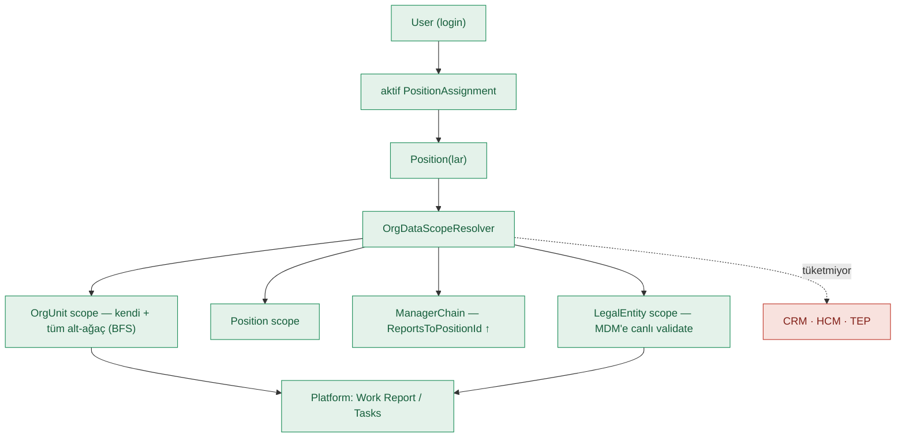
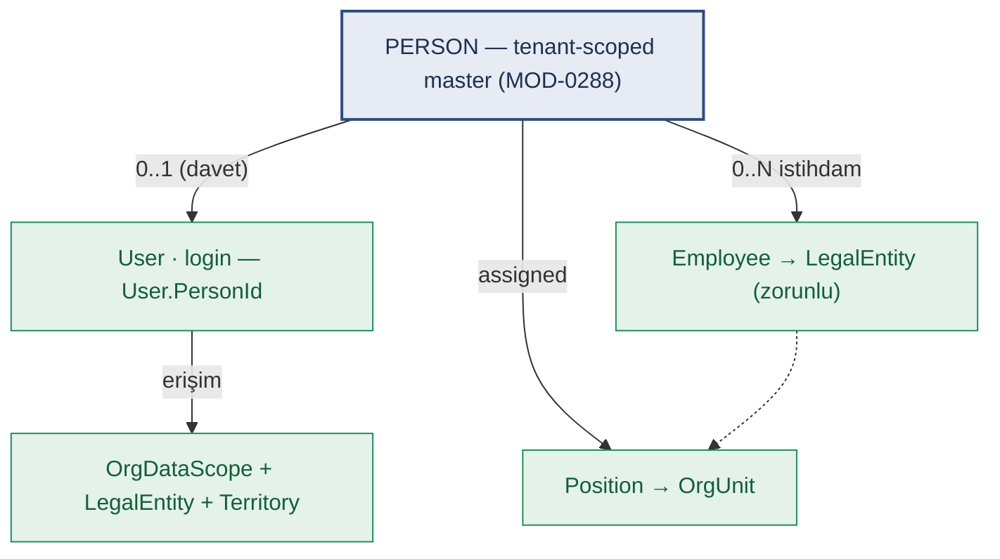
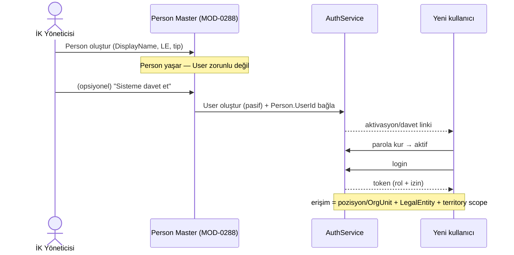

# İK Kimlik ve Erişim Mimarisi — Analiz Raporu

> **ERP-vNext · Control Tower · Mimari Analiz** — HR + Talent + Organization arasındaki bağların, employee oluşturma akışının ve erişim-scoping modelinin mevcut durumu; SAP/Oracle referansı, eksik bağlar ve hedef model.
> **Kod değiştirilmedi** — yalnız ölçüm ve sentez.

| | |
|---|---|
| **Branch** | `fix/hr-integration-gaps` |
| **Tarih** | 2026-09-15 |
| **Yöntem** | 4 paralel kod/veri analizi + blueprint + SAP/Oracle referansı |
| **Tenant** | 97c5 (demo) |
| **Artifact** | https://claude.ai/artifact/SYWzcGsYwnytsg8LeeB6Vh |

**Durum lejantı:** 🟢 canlı/çalışıyor · 🟡 ertelenmiş (stub / Ali) · 🔴 eksik/bloklu · 🔵 master/SoR

---

## §1 — Yönetici özeti

HR sayfaları menüde görünür, RBAC + L10n tamam (WP-A/B/C/D). Ama **sistemin İK tarafı uçtan uca çalışmıyor**: employee oluşturma zinciri, Talent→employee geçişi ve "kim neyi görebilir" erişim modeli üç yük-taşıyan *seam* üzerinde duruyor ve üçü de kasıtlı olarak ertelenmiş.

- **🔴 Kimlik köprüsü yok (User ↔ Person ↔ Employee):** `auth User`'da PersonId/EmployeeId **yok**; blueprint'te PersonReference↔auth bağı **açıkça tanımsız** (DCP-006 not #9). Login olan kişi hangi employee, bilinmiyor.
- **🔴 Person master boş (MOD-0288 · person_references):** Person = salt-okunur `PersonReference`, koleksiyon **0 kayıt**, create yolu yok, frontend yok (yalnız picker). Employee için ön koşul olan PersonId üretilemiyor.
- **🟡 Akışlar bloklu (3 deferred seam):** Employee promote **409-blocked**; Projection←HcmService feed **stub**; legal_entities claim **main'de yok**. Üçü de go-live öncesi **Ali**'de.

---

## §2 — Mevcut durum: üç servis, üç olgunluk

| Servis | Port / Modül | Olgunluk | Ne çalışıyor / ne shell |
|---|---|---|---|
| **HcmService** | 5060 · MOD-0251 · `HCM-EMPLOYEE-MASTER` | 🟡 yarı-canlı | Gerçek draft-authoring backend; 4 referansı **canlı** doğruluyor. Ama **promote→Employee 409-blocked**. Employee satırı yalnız smoke-fixture ile doğuyor. Employees sayfası salt-okunur. |
| **HumanCapitalService** | readiness · `HUMAN-CAPITAL` · 23 sayfa | 🟡 çoğu placeholder | ~20 sayfa **readiness state-machine** (veri yok). 3 gerçek read-model (EmployeeProjections, PositionAssignments overlay, SensitiveAccess) — hepsi **deferred stub** → yalnız `Deferred` state; overlay yazılamıyor (403). |
| **TalentEcosystemService** | 5064 · `TALENT-ECOSYSTEM` · 30 sayfa | 🔴 tamamen shell | 30 modül de **readiness-shell**; gerçek kişi verisi yok (PII yasak). **Hire/convert komutu yok, HR'a transport yok.** Yalnız MDM'e (legal-entity) çağrı var. |

> **Ölçülen çelişki:** Blueprint bu işlevi ayrı MOD'lara böler (0298 HR workspace · 0299 assignment orchestration · 0305 offboarding · 0314 sensitive policy · 0316 comp/benefits · 0322/0327 talent). Uygulamada hepsi **iki catch-all servise** (HUMAN-CAPITAL, TALENT-ECOSYSTEM) toplanmış. Kod ≠ blueprint granülaritesi — go-live öncesi uzlaştırma gerekir.

---

## §3 — Kimlik & SoR haritası

Sistemde iki paralel "omurga" var, ortak referans yalnız Position/OrgUnit (MOD-0288). Kritik boşluk: **User ↔ Person** bağı hiçbir yerde yok.

### Şekil 1 — Varlıklar, SoR ve bağlar (mevcut durum)

*Düz ok = canlı bağ · kesikli = ertelenmiş/stub · `x--x` = hiç olmayan bağ (User↔Person). Employee `PersonId`→Person canlı doğrulanır ama promote bloklu olduğu için Employee hiç dolmaz.*

| Varlık | SoR (servis / MOD) | Ne | Durum |
|---|---|---|---|
| **User** | AuthService | Login kimliği (email/parola/rol). Person/Employee bağı yok. | 🟢 canlı |
| **Person** | Platform · MOD-0288 | `PersonReference` (DisplayName, ReferenceCode, ProfilePointer→HRIS). Salt-okunur, boş. | 🔴 boş/işlevsiz |
| **Employee** | HcmService · MOD-0251 | İstihdam kaydı; PersonId + OrgUnit + Position + LegalEntity referansları. | 🟡 promote bloklu |
| **OrganizationUnit** | Platform · MOD-0288 | Org ağacı; LegalEntityId + ParentOrgUnitId + ManagerPositionId. | 🟢 canlı |
| **Position** | Platform · MOD-0288 | Koltuk; OrgUnitId + ReportsToPositionId (raporlama zinciri). JobTitle ≠ RBAC rol. | 🟢 canlı |
| **PositionAssignment** | Platform · MOD-0288 | **UserId→PositionId**; efektif-tarihli, tek-Primary guard. Erişimin authoritative kaynağı. | 🟢 canlı |
| **LegalEntity** | MDM · MOD-0220 | Yasal tüzel kişi. 97c5'te 5x "Diten *" (GrandMedical/Seton yok). | 🟢 canlı |
| **Territory** | CrmService · MOD-0151 | MicroZone hiyerarşisi; TerritoryResourceAssignment Position→zone. 1063 node. | 🟢 canlı |

---

## §4 — İki "Position Assignment": hangisi doğru taraf

Aynı isim iki serviste var ama **farklı katman**: biri erişim, diğeri istihdam. Duplikasyon değil — HR tarafı Organization tarafına *referans veren* bir overlay.

| | Organization (doğru taraf) | HR overlay |
|---|---|---|
| **Servis / kayıt** | Platform · `PositionAssignment` | HumanCapital · `EmployeePositionAssignmentOverlay` |
| **Neyi bağlar** | `UserId → PositionId` | `EmployeeProjectionId + PersonRef → Position` |
| **Doğrulama** | IUserReferenceValidator (auth, canlı) | deferred stub → 403 |
| **Amaç** | Org yapısı + **erişim/veri-scoping** | İK istihdam görünümü (yönetici zinciri, hassas-erişim) |
| **Tüketen** | OrgDataScopeResolver → tüm Platform authz | HR süreçleri (henüz yazılamıyor) |
| **Durum** | 🟢 canlı | 🔴 yazılamıyor (403) |

> **Karar:** "Kim hangi pozisyonda" **erişim için** authoritative olan tek kayıt **Platform PositionAssignment** (UserId→Position) — çünkü `OrgDataScopeResolver`'a bağlı tek odur. Org-yapı ataması **Organization sayfalarından** yapılmalı. HR'daki PositionAssignments sayfası bir *istihdam overlay*'idir ve bugün deferred stub yüzünden işlevsiz. İki taraf, User↔Person köprüsü kurulunca hizalanır.

---

## §5 — Employee yaşam döngüsü (MOD-0251)

Maker-checker draft akışı gerçek ve referansları canlı doğruluyor — ama **promote adımı hem controller hem handler seviyesinde 409 ile kapatılmış**. Hiçbir draft Employee'ye dönüşmüyor.

### Şekil 2 — Employee draft → promote akışı ve blok noktası

*Zorunlu payload: person_id, legal_name, worker_type, employment_type, hire_date, organization_unit_id, position_id, legal_entity_id, sensitivity_level. `SubmitEmployeeDraftHandler` + workflow-decision consumer ikisi de hard-409. EmployeeStatus vocab tanımlı (draft→active→…) ama hiçbir kod satırı draft'ı ilerletmiyor.*

> **Zincir kırığı:** Employee oluşturmak `person_id` ister → Person master boş + create yolu yok (§3). Promote bloklu olsa bile **seçilecek Person yok**. Yani employee-oluşturma bugün iki katmanda birden çalışmıyor: (1) Person üretilemiyor, (2) draft promote edilemiyor.

---

## §6 — Talent → Employee veri akışı

İsimlendirme bir akış vaat ediyor (`CandidateReference`, `HcmFoundationReference`, `CandidateTransitionBoundaryState`) ama **kodda hiçbir ok kurulu değil**: ne hire komutu, ne servisler arası transport, ne tipli kimlik köprüsü.

### Şekil 3 — Aday → employee (tasarlanan ama kurulmamış akış)

```mermaid
flowchart LR
  C["TepCandidateProfile — CandidateReference (string)"]:::defer -->|"Evaluate (sadece state flip)"| C2["Active / Published"]:::defer
  C2 -.->|"handoff YOK — komut/event yok"| P1["CandidatePipeline (HC shell)"]:::miss
  P1 -.->|"CandidateTransitionBoundaryState = Deferred"| P2["EmployeeOnboarding (HC shell)"]:::miss
  P2 -.->|"kimlik köprüsü yok"| PR["EmployeeProfileProjection — Deferred"]:::defer
  PR -.->|"feed stub (seam #2)"| E["Employee · MOD-0251"]:::defer
  classDef defer fill:#f8efd9,stroke:#b0721a,color:#7a4d09;
  classDef miss fill:#f8e2de,stroke:#c0392b,color:#822018;
```

*TEP'in tek dış çağrısı MDM (legal-entity scoping). Employee tarafında `CandidateReference` saklayacak alan bile yok — provenance kaydedilemez. TEP guard'ları PII'yı (nationalid, payroll, employee_statement) aktif olarak yasaklıyor: gerçek istihdam verisinin kaynağı TEP değil, HRIS/HCM olmalı.*

---

## §7 — Erişim & scoping mimarisi

`OrgDataScopeResolver` (MOD-0018-FU15) gerçek ve iyi tasarlanmış: kullanıcının **aktif PositionAssignment**'larından dört tür scope üretir. Ama bugün yalnız **Platform** (Work Report/Tasks) tüketiyor; **CRM/HCM/TEP tüketmiyor**.

### Şekil 4 — Login → pozisyon → veri scope çözümü

*Bağlam yalnız **ilk** LegalEntity'yi tutuyor (`[0]`) → çok-legal-entity toplaması yok. CEO gibi kök pozisyon tüm alt-ağacı toplar (tenant-geneli), ama bunu sadece OrgUnit-scope'u onurlandıran tüketiciler kullanır.*

### Üç erişim örneği — mekanizma ve durum

| Senaryo | Gereken mekanizma | Bugün |
|---|---|---|
| **CEO — tüm legal entity'leri görür** | Kök pozisyon → OrgUnit alt-ağaç = tüm birimler. (Oracle: pozisyon hiyerarşisi tepesi / AOR = tüm legal employer.) | 🟡 kısmi — OrgUnit-scope çalışır ama bağlamda tek LegalEntity; çok-LE toplaması yok |
| **Medical rep — sadece kendi zone'u** | rep→LE→territory-zone ACL. (rep pozisyonu 97c5'te var: `medical-representative`.) | 🔴 eksik — territory yalnız UI filtre chip'i; kimlik-ACL değil. Rep tüm tenant hesap listesini görebilir |
| **Finans dir. — kendi LE + verilen Seton** | UserLegalEntityAssignment + `legal_entities` claim + X-Legal-Entity-Id + effective roll-up (HCM/TEP'te `HttpLegalEntityContext` hazır) | 🔴 eksik — `legal_entities` claim main'de yok (seam #1). Kod hazır, besleyen claim yok |

> **Demo verisi notu:** 97c5'te legal entity'ler **"Diten *"** (LE-001…005) — *GrandMedical / Seton yok*. Pozisyonlar gerçek: `CEO`, `medical-representative`, `area-manager`, `regional-manager`, `division-manager`, `HR_MGR` vb. (17 pozisyon). Territory zengin dolu (1063 node, 43.374 hesap ataması). Örnekleri test etmek için legal-entity + person + assignment seed'i gerekir.

---

## §8 — Referans mimari: SAP & Oracle

İki lider HCM sistemi de **Person'ı merkeze** koyar; User ve Employment ayrı, opsiyonel katmanlardır. Erişim, pozisyon/org + legal-employer scope'una dayanır. ERP-vNext'in mevcut parçaları bu modele zaten meyilli.

| Kavram | SAP SuccessFactors | Oracle Fusion HCM | ERP-vNext karşılığı |
|---|---|---|---|
| **Kişi** | Person object (kişi başına 1, biyografik) | Person (party) | `PersonReference` (MOD-0288) — boş |
| **İstihdam** | Employment object (N; eşzamanlı/global) | Assignment (her biri bir Legal Employer'a zorunlu) | `Employee`/`EmploymentRecord` (MOD-0251) |
| **Login** | User (ayrı yönetilir) | User (worker'a bağlanır) | `User` (AuthService) — Person'a bağsız |
| **Org yapı** | Foundation Objects: Legal Entity, BU, Division, Position | Org tree + Position hierarchy | `OrgUnit` + `Position` (MOD-0288) |
| **Erişim** | RBP + target population | Data Role + Security Profile (person/org/position/LE) + Area of Responsibility | `OrgDataScopeResolver` + (eksik) legal_entities claim |

Örneklerinizin birebir karşılığı Oracle'da: **CEO** = pozisyon hiyerarşisi tepesi / tüm legal-employer AOR; **med-rep** = position security profile + territory; **finans dir.** = iki-scope'lu security profile. Hedef model yeni icat değil — sektör standardı.

*Kaynaklar: [SAP SF Person & Employment](https://learning.sap.com/courses/sap-successfactors-employee-central-core-academy/using-special-hr-transactions-for-hires-and-terminations_e8c3ec4e-0435-4920-89ce-29ded46e87bf) · [SAP SF Data Models](https://help.sap.com/docs/successfactors-onboarding/implementing-onboarding/data-models-in-sap-successfactors) · [Oracle HCM Data Roles & Security Profiles](https://docs.oracle.com/en/cloud/saas/human-resources/20b/ochus/hcm-data-roles-and-security-profiles.html) · [Oracle Legal Employer](https://unogeeks.com/legal-entity-table-in-oracle-fusion-hcm/)*

---

## §9 — Eksik bağlar (gap register)

| # | Eksik bağ | Etki | Sahip | Durum |
|---|---|---|---|---|
| **G1** | **User ↔ Person köprüsü** (blueprint'te tanımsız — DCP-006 #9) | SelfService, hassas-erişim, per-employee authz, legal_entities hepsi buna muhtaç | Karar: siz | 🔴 tanımsız |
| **G2** | **Person master işlevsiz** — create yolu + frontend yok, koleksiyon boş | Employee için PersonId üretilemiyor; zincir başında kopuk | Karar: siz | 🔴 eksik |
| **G3** | **MOD-0251 promote bloklu** (Submit + workflow-decision 409) | Hiçbir draft Employee olamıyor; maker-checker başlamıyor | Ali (lifecycle gate) | 🟡 ertelenmiş |
| **G4** | **Projection ← HcmService feed** stub (seam #2) | EmployeeProfileProjection yalnız Deferred; HR read-model'leri beslenmiyor | Ali | 🟡 ertelenmiş |
| **G5** | **legal_entities JWT claim** main'de yok (seam #1) | Çok-LE / cross-LE erişim (finans dir. örneği) çalışmıyor | Ali (token sözleşmesi) | 🟡 ertelenmiş |
| **G6** | **CRM territory kimlik-ACL yok** — sadece filtre chip | Med-rep tüm tenant hesaplarını görebilir | CRM (MOD-0151 + resolver tüketimi) | 🔴 eksik |
| **G7** | **DataScopeResolver cross-service tüketilmiyor** | Her servis ayrı scope'luyor; tek kaynak yok | Mimari | 🔴 eksik |
| **G8** | **Talent→Employee handoff** — komut/transport/köprü yok | Aday hiçbir zaman employee olamıyor | Ali / mimari | 🔴 eksik |

**Bizim (CT) kapsamımız:** G1–G2 sizin kararınız + inşa edilebilir iş. G3–G5, G8 **Ali**'ye ait (lifecycle gate, HRIS feed, token sözleşmesi, Talent handoff). G6–G7 ayrı CRM/mimari işi.

---

## §10 — Hedef model & provizyon akışı

Önerilen: **Person = merkez**. Kod zaten buraya meyilli (Employee.PersonId, Projection.PersonReferenceId). User = Person'ın opsiyonel login'i, Employee = Person'ın opsiyonel istihdamı.

### Şekil 5 — Hedef kimlik modeli (Person merkez / party modeli)

*Her Person'ın User'ı olmayabilir (giriş yapmayan çalışan); her User Person olmayabilir (servis hesabı); bir Person'ın 0..N istihdamı olabilir. SAP Person/Employment + Oracle Person/Assignment ile aynı.*

### Şekil 6 — Provizyon / davet akışı (Person önce, User opsiyonel)

*Önerilen: `User.PersonId` bir **alan olarak** saklanır (token sözleşmesini değiştirmez); `person_id`/`legal_entities`'i token'a claim basmak ayrı, sonraki bir karardır (seam #1). Böylece User↔Person köprüsü bugün güvenle kurulabilir.*

---

## §11 — Karar noktaları

| # | Karar | Durum |
|---|---|---|
| 1 | **Hub modeli → Person merkez** | ✅ onaylandı |
| 2 | **User↔Person bağı → User.PersonId (alan olarak)** | ✅ onaylandı — hesap kimliğe tabidir; alan saklamak token'ı değiştirmez, token'a claim basmak ayrı (seam #1) |
| 3 | **Person SoR** | ⏳ **açık** — "user nerede ise Person orada" = fiziksel AuthService mi, yoksa "tenant-bazlı olsun, global olmasın" mı? PersonReference **zaten** Platform'da + tenant-scoped. Öneri: Platform'da kalsın + `User.PersonId` köprü. |
| 4 | **Provizyon → Person önce, sonra davet** | ✅ onaylandı — Person bağımsız yaşar; "Sisteme davet et" → User (pasif) + aktivasyon linki |

> **Sıradaki adım:** Karar #3 netleşince: (a) Person master'ı işlevsel yap (create + CRUD API/UI, G2), (b) User↔Person köprüsü + davet akışı (G1). Bunlar bizim kapsamımızda inşa edilebilir. G3–G5/G8 (promote gate, HRIS feed, legal_entities claim, Talent handoff) Ali'de kalır ve go-live öncesi bunlarla birleşir.

---

*ERP-vNext · Control Tower · İK Kimlik & Erişim Analizi · 2026-09-15 · kod değiştirilmedi (salt-okunur ölçüm). Kanıt: `OrgDataScopeResolver.cs` · `Employee.cs` · `PositionAssignment.cs` · `EmployeeProfileProjection.cs` · `EmployeePositionAssignmentOverlay.cs` · `docs/records/audits/2026-09/auth-legal-entities-claim-port-deferred-2026-09-14.md` · MOD-0251 spec v1.5 · DCP-006.*
