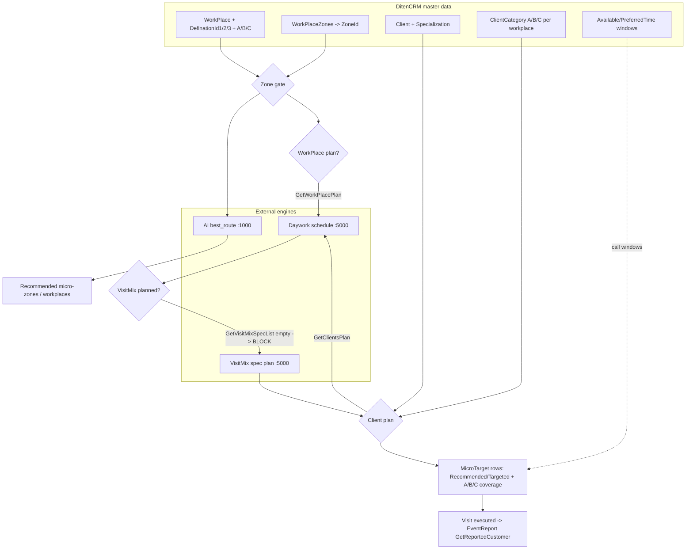
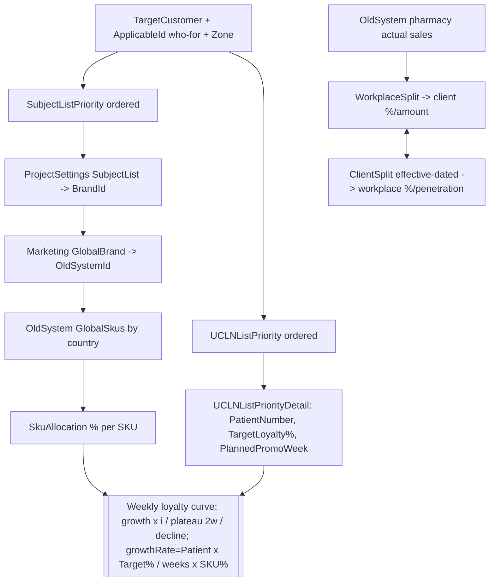

# Legacy CRM2 — CRM & Marketing Logic Analysis

READ-ONLY analysis of the legacy system under `C:\CRM2\`. Source of truth is the code; memory notes were used only for orientation. Covers **DitenCRM**, **DitenCrmV2**, **Campaign**, **Content**, **Marketing**, **Territory**, plus the external services these projects depend on.

> Scope note: every project is a .NET CQRS/MediatR microservice (Domain / Application[Commands,Queries,Handlers] / Infrastructure[APIs] / Persistence-Mongo). The **real logic lives in Query/Command handlers and in the external HTTP services they call**, not in the (deliberately thin) domain entities.

---

## 0. System topology & external dependencies

The CRM/marketing services are thin over a set of shared HTTP back-ends. Key integration seams found in the `*.Infrastructure/APIs` folders:

| Called service | Host/Port (dev) | What it provides |
|---|---|---|
| **AI engine** (`AIAPIs`) | `http://localhost:1000/abc_api/best_route` | The geo/route optimizer. Returns `BestRouteMicroTargetResponse` (ordered visits with `ZoneID`, `VisitId`, `VisitName`, `VisitDate`, `Category`, `DefinationId`). This is the "best_route" AI. |
| **Daywork / OldSystem** (`DayworkAPIs`, `OldSystemAPIs`) | `http://localhost:5000/services/...` | The actual **day/week schedule engine** and legacy master data. Endpoints: `Daywork/MicroTarget/GetWorkPlacePlan`, `.../GetClientPlan`, `VisitMix/GetVisitMixSpecList`, `Daywork/EventReport/GetReportedCustomerByWorkPlaceIds`; plus specs, zones, micro-zones, business units, companies, employees, SKUs, pharmacy sales, CBP, FTE. |
| **AdminPanel** (`AdminPanelAPIs`) | port 5000 | `GetAllDefinations` / `GetDefinitionNameByDefinitionId` — the polymorphic "defination" lookup used for place/type/priority names (language-scoped). |
| **ProjectSettings** | `http://localhost:5000/services/ProjectSettings/...` | **SubjectList** (`GetSubjectListByIds`, `GetSubjectListBySubjectId`), **ForWhom** (`CreateForWhom`), **UCLN design** (`GetUCLNDesignPropertyIdsById`). |
| **HR** (`HrAPIs`) | 5000 | `GetHolidays(countryId)` — feeds working-day math in TotalVisitNumber. |
| **Company** (`CompanyAPIs`) | 5000 | `GetCountriesByCompanyIds`, `GetCompaniesByIds` (→ `OldSystemCompanyId`, `CountryId`). |
| **Marketing** (`MarketingAPIs`) | — | `GetGlobalBrandForTargetCustomer` (GlobalBrand ↔ `OldSystemId`). |
| **Territory** (`TerritoryAPIs`) | — | `GetCountryInfo` (→ `OldSystemCountryId`). |

**Implication for vNext:** the schedule/route/VisitMix engines are *external* to these repos (Daywork + AI). DitenCRM is a **gating & presentation façade** over them; the genuine, self-contained business logic is in **Campaign** (capacity/frequency math) and **DitenCrmV2** (loyalty & sales-split math).

---

## 1. DitenCRM (legacy CRM v1) — master data, MicroTarget, Visit Planning

### 1.1 Entities (`Diten.CRM.Domain/CRMAggregate`)
All extend `BaseEntity` (int `Id`, `Status` soft-delete flag, audit fields).

- **WorkPlace** — clinic/hospital/pharmacy. Geo (`CountryId/CityId/RegionId/AreaId/District`, `Longitude/Latitude`), `Category` (A/B/C string), three polymorphic classifiers `DefinationId1` (Place), `DefinationId2` (PlaceType), `DefinationId3` (TypeOfPriority), `WorkPlaceIds` (self-link list for connected places), `ValidStatus`.
- **Client** — HCP. `ClientTypeId`, `SpecializationId`, `DegreeId`, `KeyOpinionLeader`, `DecisionMaker`, `ValidStatus`, `CountryId`, `CompanyId`, `OldSystemClientId`.
- **ClientCategory** — join Client↔WorkPlace with a per-workplace `Category` (A/B/C) and `PositionId`, `StartDate`. This is what makes a client "A/B/C at a given workplace".
- **WorkPlaceZones** — join WorkPlace↔`ZoneId` (+`StartDate`). Territory membership.
- **AvailableTime / PreferredTime** — per `ClientCategoryId`, per `DayId`, `StartTime`/`EndTime` strings. Per-contact call windows.
- **Applicable** — a *property namespace / archetype*. Flags `isUsedForWhom` and `isUsedBrandReleationShip`. Creating an Applicable with `isUsedForWhom=true` calls `ProjectSettingsAPIs.CreateForWhom(...)`; `isUsedBrandReleationShip` feeds Marketing brand-relationship. `ApplicableId` is later reused in V2 as *"who is this loyalty for"*.
- **Property / PropertyList / PropertyConnection / CrmConnection** — a generic EAV/taxonomy engine. `Property` (a field, belongs to an `ApplicableId`, can be a group, has `ParentPropertyId`), `PropertyList` (an option value, `TypeId`→Property), `PropertyConnection` (an Applicable's selected option set), `CrmConnection` (directed option→options graph, `FromPropertyListId`→`ToPropertyListIds`). Drives UCLN Book design and brand relationships.
- **City** — geo reference (with `OldSystemId`).

### 1.2 MicroTarget gating logic (`GetMicroTargetByFilterHandler`) — the core flow
This handler is the "MicroTarget" screen. It is a **staged funnel** keyed on which filters the user has supplied. Inputs: employee, Year/Month/Week, Company/BusinessUnit/Zone, `MicroZoneIds`, `PlaceIds`/`PlayeTypeIds`/`TypeOfPriorityIds` (the three WorkPlace classifiers), `PlaceCategories`, `ClientCategories`.

Gates (in order):
1. **Zone gate.** Load `WorkPlaceZones` for `ZoneId`, then valid `WorkPlace`s in those zones. Call `AIAPIs.BestRouteMicroTarget()` (best_route) — wrapped in try/catch so a dead AI degrades gracefully.
2. **MicroZone level** (`PlaceIds.Count == 0`): fold best_route down to distinct zones = **Recommended** rows (`IsRecommended=true, Criteria="Recommended"`); micro-zones present in `microZones` but not in best_route become **Targeted** rows. Each row carries `A`/`B`/`C` = `covered/total` counts by workplace category, `TravellingTime=30` (hard-coded).
3. **WorkPlace level** (`ClientCategories.Count == 0`): call `DayworkAPIs.GetWorkPlacePlan(...)` (the external schedule). Planned workplaces = Targeted; best_route workplaces (filtered to the zone) = Recommended, ordered by best_route index; remaining filtered workplaces (matching all three classifiers) = Targeted, with `A/B/C` = client-category counts per workplace.
4. **VisitMix + Client level** (`ClientCategories` supplied): **hard gates** —
   - if `GetWorkPlacePlan` returns nothing → `Fail("First of all, you need to make a workplace plan")`.
   - `DayworkAPIs.GetVisitMixSpecList(...)`; if empty → `Fail("First of all, you should plan Visitmix!")`.
   - then `DayworkAPIs.GetClientsPlan(...)` → planned clients = Targeted (recommended). Clients that match the plan's workplaces + a **VisitMix-approved specialization** but are not yet planned are appended as Targeted (`IsRecommended=false`). Specs cached 1 day (`cacheCountry`).

So the legacy gate chain is exactly: **Zone → (best_route) → WorkPlace plan → VisitMix (spec) → Client plan**, each stage refusing to proceed until the upstream plan exists. Coverage is always reported as `A/B/C = done/total`.

### 1.3 Visit Planning handlers
`Get{Client,WorkPlace,Clinics,Pharmacies}ForVisitPlanning*` simply project **filtered CRM master data** (e.g. `GetClientForVisitPlanningHandler`: clients of a workplace, of a given `ClientTypeId`, valid, with their per-workplace `Category` and spec name). The visit *schedule* itself is produced by the external Daywork service — DitenCRM only supplies the eligible universe and the A/B/C categorisation.

### 1.4 "UCLN Book" content (`GetPropertyConnectionsForUCLNBookHandler`)
Given a UCLN-design id, calls `ProjectSettingsAPIs.GetUCLNDesignPropertyIdsById` → `Property` set → their `Applicable`s → `PropertyConnection`s (enabled) → `PropertyList` options, and returns a nested *Applicable → Property → PropertyOptions(with ParentGroupIds)* structure. This is the property/taxonomy "book" that drives UCLN classification design (the option graph a UCLN list is built from). The loyalty numbers themselves are computed in DitenCrmV2 (§3).

---

## 2. Campaign — CyclePeriod, capacity (TotalVisitNumber), PromoCampaign frequency

### 2.1 Entities (`CampaignManagementAggregate`) — Mongo, string ids
- **CyclePeriod** — `PeriodName`, `Color`, `Year`, `CompanyId`, `BusinessUnitId`, `StartMonth`/`EndMonth`, `List<CycleMeetings>{StartDate,EndDate}`, and **`CyclePeriodStatus`: 0=redact, 1=Waiting Data, 2=Auto, 3=Valid, 4=Approved**.
- **CyclePeriodCalendar** (1:1 with CyclePeriod) — the **minute-budget model**. All durations in minutes: `PromoProductTime`, `NonPromoProductTime`, `BetweenVisitTime`, `TravelingTime`, `ReportDuration`, `MicroTargetingDuration` (+`MicroTargetingDay` list & `MicroTargetingTime`), `QuizDuration`, `MarketingResearchDuration`, `TrainingDuration`, `VisitOpeningDuration`, `UxDuration`. Plus a matrix `List<CalendarRow>{RowId, List<CalendarRowMonth>{MonthId,Value}}` — a per-row, per-month numeric grid. **Row-id semantics observed in code:**
  - `RowId 2` = Zone target (spec) quantity; `RowId 4` = Frequency;
  - `RowId 10` = calendar field day; `RowId 12` = AI Client %; `RowId 13` = AI WorkPlace %;
  - `RowId 14` + `RowId 15` = precomputed valid visit values for past/closed months (summed directly instead of recomputed);
  - `RowId 16/17/18` = per-product promo-time percentages.
- **PromoCampaign** — `CyclePeriodId`, `PlaceId`, `PlaceTypeIds`, `PropertyTypeIds`, `WorkPlaceCategories`, `ClientTypeId` (0 ⇒ campaign is workplace-oriented, non-0 ⇒ client-oriented), `MarketReserachStatus`, `PromoCampaignStatus` (0=in progress,1=done).
- **PromoCampaignDetail** — per `SpecializationId`+`Category`, a `List<Calendar>{RowId, List<decimal> Values}` (12 monthly values). Holds frequency (row 4), zone target qty (row 2), product % (rows 16–18) per spec/category.
- **PromoCampaignSpecialization** — which spec+categories a promo campaign covers.

### 2.2 TotalVisitNumber (capacity) formula — `GetCyclePeriodTotalVisitNumberHandler`
For each cycle period, for each month `StartMonth..EndMonth`:
- **Past/current months** (`monthStart <= now`): take precomputed values, `Value += Σ CalendarRows(RowId∈{14,15}).monthValue`.
- **Future months**: compute from the minute budget.
  - `totalWorkingDay = calendarDays − (weekends + holidays + vacation + cyclesBetween)` (vacation/cyclesBetween = 0 here). Holidays from `HrAPIs.GetHolidays(countryId)` filtered to year+month; weekends via `GlobalFunctions.Weekends`.
  - `calendarFieldDay = totalWorkingDay − (meeting + training + otherActivity + outofFieldDay)` (all 0 in this path).
  - `spendMinuteTotal = ReportDuration + TravelingTime + MicroTargetingDay.Count × MicroTargetingDuration + QuizDuration`.
  - `totalMinutesInDay = 8 × 60 = 480`.
  - `promoAndNonPromo = PromoProductTime + NonPromoProductTime`.
  - **`TotalVisitNumber = ((480 − spendMinuteTotal) / promoAndNonPromo) × FTE × calendarFieldDay`** (rounded); `FTE` from `OldSystemAPIs.GetBurMrFte(businessUnitId, year)[month]`.
  - `Value += TotalVisitNumber`.

Result: per-cycle **`Total`** = the number of visits the field force can physically deliver in that cycle. `TotalVisitNumber` is a *derived* value — never persisted.

### 2.3 Auto cycle creation — `AutoCyclePeriodHandler`
Scheduler-style. Finds the most recent past cycle per BusinessUnit; if no cycle already covers the current month for that BU, **clones** it into a new `CyclePeriod` (`CyclePeriodStatus=2` "Auto", `CreatedBy="System"`, name `AutoCreated_<date>`, random color, current month as start=end) and clones its `CyclePeriodCalendar` (carrying the latest month's row values forward). Keeps a rolling capacity plan alive without manual entry.

Status transitions elsewhere: `UpdateAllWaitingDataCyclePeriodsToRedact`, `UpdateAllCyclePeriodsValidStatus`, `UpdateCyclePeriodStatus` — the 0→1→2/3→4 lifecycle.

### 2.4 PromoCampaign frequency & CBP remaining — `GetTargetedVisitTotalByCyclePeriodIdsHandler` / `GetCampaignRemainingProductsHandler`
- **Targeted visit total:** per promo campaign, per month, pull `ZoneTargetSpecQuantity` (detail row 2) and `Frequency` (detail row 4) from `PromoCampaignDetail.Calendar[month−1]`. Frequency × zone-target drives how many visits a spec/category should receive.
- **Remaining products (CBP gap):** the richest formula. For each product (GlobalBrand) and month:
  - `spendMinuteTotal` here also adds Training + BetweenVisit + VisitOpening + Ux durations.
  - `totalVisit = ((480 − spendMinuteTotal)/promoAndNonPromo) × FTE × (AI% /100) × calendarFieldDay`, where AI% = **row 12 (client)** if `ClientTypeId≠0` else **row 13 (workplace)**.
  - `productPercent = ((promoDurationPercent1/100) × zoneTargetQuantity) / totalVisit × 100`.
  - `getCBP` = `OldSystemAPIs.GetCBP(...)` quarterly brand target (`GlobalFunctions.GetQuarterFromMonth`).
  - **`remaining = round(CBP.Amount − productPercent)`** → the still-uncovered share of the brand's cycle-brand-plan.

This is the join point **capacity (TotalVisitNumber) → per-product promo mix (%) → CBP target → remaining gap**, i.e. how much campaign pressure is still owed per product.

---

## 3. DitenCrmV2 — TargetCustomer / SubjectList / UCLN loyalty / sales replication

Mongo, **string ids**, `CountryId`/`ZoneId` first-class. Two families: master data (Client, Workplace, their Zone/PropertyList joins, `CrmConnection`) and the planning aggregates below.

### 3.1 TargetCustomer & its satellites (`TargetCustomer.cs`)
- **TargetCustomer** — a per-rep/zone loyalty plan target. `TargetCustomerTypeId` (1=Individual, 2=Activity), `CountryId`, `ZoneId`, **`ApplicableId` = "who is this loyalty for"** (reuses DitenCRM Applicable/ForWhom archetype), `WorkplaceId`, `ClientId`; for Activity type, `ActivityDefinitionId` + `PropertyListIds`.
- **SubjectListPriority** — orders `SubjectListId`s for a TargetCustomer (`Order`). SubjectList itself lives in **ProjectSettings** and carries a `BrandId` (SubjectList ≈ brand/message theme).
- **SkuAllocation** — per (TargetCustomer, SubjectList, SkuId) a `Percentage`. SKU-level split of a brand/subject.
- **UCLNListPriority** — orders UCLN lists (`UclnListId`) under a (TargetCustomer, SubjectList).
- **UCLNListPriorityDetail** — the loyalty inputs: `PlannedPromoWeek`, `ActualSalesProportionalPercentage`, `TargetLoyaltyPercentage`, `PatientNumber`.

### 3.2 SubjectList → SKU% binding (`GetSkuAllocationByTargetCustomerIdHandler`, `CreateTargetCustomerSkuAllocationHandler`)
For a TargetCustomer, resolves its ordered SubjectLists → (via ProjectSettings) their `BrandId` → (via Marketing `GetGlobalBrandForTargetCustomer`) the brand's `OldSystemId` → (via OldSystem `GetGlobalSkusByProductIds`, scoped to `OldSystemCountryId`) the SKU catalogue, then overlays saved `SkuAllocation.Percentage`. UI shows `TotalPercentage = Σ SKU%` per subject list. Create/update is an upsert keyed on `(SkuId, SubjectListId)`. **This is the "SubjectList binds product→%→content" mechanism** — SubjectList = the brand/theme, SkuAllocation = the % split across that brand's SKUs.

### 3.3 UCLN loyalty-curve algorithm (`GetUclnListLoyaltyPlanHandler`) — the headline calculation
Given TargetCustomer + `SkuId` + `BrandId`:
1. `baseDate = TargetCustomer.CreatedDate`; `firstWeekStartDate` = next Monday after baseDate.
2. `SkuAllocation.Percentage` for the SKU; ordered `UCLNListPriority` rows for the (TargetCustomer, Brand).
3. **Growth rate** per UCLN detail:
   `growthRate = (PatientNumber × (TargetLoyaltyPercentage/100) / PlannedPromoWeek) × (SkuAllocation/100)`.
4. Build a **trapezoidal weekly loyalty curve** per UCLN list (concatenated with a rolling `weekOffset`):
   - **Growth** weeks `1..PlannedPromoWeek`: `loyalty = growthRate × i` (ramp up).
   - **Plateau** `stayWeeks = 2` (hard-coded): `loyalty = growthRate × PlannedPromoWeek` (hold peak).
   - **Decline** weeks `1..PlannedPromoWeek`: `loyalty = max(0, growthRate×PlannedPromoWeek − growthRate×i)` (ramp down).
   - Each week emits `{WeekNumber, LoyaltyValue = ceil(max(0,loyalty)), StartDate, EndDate}`.
   - `weekOffset += PlannedPromoWeek` so the **next UCLN profile begins during the previous profile's plateau** (overlapping campaigns).

So **UCLN = a per-SKU, per-week loyalty pressure curve** driven by patient count, target loyalty %, planned promo weeks and the SKU's allocation share. It is *not* a static A/B/C loyalty class — the class/priority ordering feeds a time-phased curve.

### 3.4 Sales replication (SalesReplication / Client & Workplace splits)
Two mirrored engines that reconcile pharmacy (workplace) sales down to prescribers (clients) and back:
- **WorkplaceSplit** (`SaveWorkplaceSplitHandler`, `CreateWorkplaceSplitClientsHandler`) — per (Workplace, SkuId, SalesDate). Pulls actual pharmacy sales (`OldSystemAPIs.GetPharmacySalesActualWorkplaceSplit`), `TotalSalesAmount = Σ ActualSales`. Attaches clients as `SplitDetails{ClientId, Percentage, AllocatedAmount = round(Percentage/100 × TotalSalesAmount,2)}`. New clients seeded at 0%.
- **ClientSplit** (`CreateClientSplitWorkplacesHandler`) — per (Client, SkuId, Zone, StartDate). The inverse: a client's sales spread across workplaces (`ClientSplitDetail{WorkplaceId, AllocationPercentage, PenetrationPlan}`). Re-runs **close the old split (`EndDate=today`) and create a new versioned row**, preserving prior allocation % for retained workplaces and seeding new ones at 0. Effectively an effective-dated split ledger.

### 3.5 UCLN list controller surface
`UclnListLoyaltyPlanController.GetUclnListLoyaltyPlan` exposes §3.3. `TargetCustomerController` exposes the full authoring surface: subject-list priority CRUD/reorder, SKU allocation, UCLN priority CRUD/reorder, UCLN detail. This is the CRM v2 "loyalty planning" console.

---

## 4. Content — content library & audience targeting

- **ContentList** (`ContentAggregates`) — a content item with **`ForWhomId`** (audience archetype, created from DitenCRM Applicable), `ContentTypeId`, and rich targeting dimensions: `SpecIds`, `BrandIds`, `ProfileId`, `NeedId`, `BenefitId`, `IndicationId`, `SkuId`, plus org/audience scoping `CompanyIds`, `BusinessUnitIds`, `PositionIds`, `EmployeeIds`, `WorkPlaceIds`, `ClientIds`, `ProcessIds`. `ContentId` links translated rows back to the master (`LanguageId=42` = source EN).
- `CreateContentListHandler` — dedupes on (ContentTypeId, Name); maps BU ids to "original" ids via OldSystem; then **auto-generates a translated ContentList row for every language** (`Translator.Translate` + `GlobalFunctions.GetLanguageList`). So content is authored once and fanned out per language, each row carrying the same targeting.
- Query handlers (`GetProfilesForFilter/Apply`, `GetNeedsForFilter`, `GetBenefitsForFilter`, `GetContentListApply`) resolve the Profile/Need/Benefit/Indication vocabularies and the apply-time matching. `ForWhom`/`Profile`/`Need`/`Benefit` are the content-audience taxonomy (distinct from CRM segment/microtarget).

---

## 5. Marketing — global brand & brand relationships

- **GlobalBrand** — brand master: `Name`, `Abbrevation`, `WebSite`, `ExpireDate`, `Logo`, `List<Colors>{Name,HEX,RGB,CMYK,Pantone}`, `OldSystemId` (bridge to legacy product ids). Consumed by V2 SKU-allocation and Campaign remaining-product logic.
- **GlobalBrandRelationship** — binds a `GlobalBrandId` to an `ApplicableId` with `PropertyDetails{PropertyId, PropertyListIds}` — i.e. brands are characterised through the DitenCRM Property/PropertyList taxonomy (`isUsedBrandReleationShip` Applicables). This is how a brand acquires the properties that later filter targeting.
- **GlobalBrandDocument** — brand asset/document holder.

---

## 6. Territory — geographic reference only

`Diten.Territory.Domain` contains only `Common/{Country, City, District, Language}` and the API exposes `City/Country/District/Language` controllers. **Zones, MicroZones, BusinessUnits are NOT in this project** — they are served by the OldSystem service (queried through `OldSystemAPIs`/`Daywork`). So "Territory" here = the geo hierarchy master (country→city→district) plus language reference; the operational sales-force geography (Zone→WorkPlace) is modelled by `WorkPlaceZones` (v1) / `WorkplaceZone`, `ClientZone` (v2) pointing at OldSystem `ZoneId`s.

---

## 7. Workflow map

### 7.1 Visit-planning / MicroTarget spine (DitenCRM + external Daywork/AI)



Spine in prose: **Zone membership → best_route (AI) recommendation → WorkPlace plan (Daywork) → VisitMix spec approval (gate) → Client plan (Daywork) → MicroTarget list with A/B/C coverage**, each stage refusing to advance until the upstream plan exists; execution feeds back through Daywork EventReport.

### 7.2 Capacity → campaign frequency → content spine (Campaign + Marketing + Content)

```mermaid
flowchart TD
    CP[CyclePeriod Year/BU/StartMonth-EndMonth] --> CPC[CyclePeriodCalendar minute budgets + row grid]
    FTE[OldSystem FTE per BU/month] --> TVN
    HOL[HR holidays + weekends] --> TVN
    CPC --> TVN[[TotalVisitNumber = (480 - spend)/promo+nonpromo x FTE x fieldDay]]
    CP -->|Auto clone| CP
    TVN --> PC[PromoCampaign per Place/ClientType]
    PC --> PCD[PromoCampaignDetail per Spec/Category: row2 zoneTargetQty, row4 frequency, rows16-18 product%]
    PCD --> TVT[Targeted visit total = frequency x zoneTargetQty]
    GB[Marketing GlobalBrand + OldSystemId] --> REM
    CBP[OldSystem CBP quarterly brand target] --> REM
    TVN --> REM[[Remaining = CBP.Amount - (product% x zoneTarget / totalVisit x100)]]
    PCD --> CONTENT[Content targeting by Brand/Spec/ForWhom]
```

Spine in prose: **CyclePeriodCalendar minute budget + FTE + working days → TotalVisitNumber (capacity)**; capacity + **PromoCampaignDetail frequency/zone-target/product-% → targeted visits and per-product remaining vs CBP**; brand/spec selections then drive **Content** (per-brand, per-spec, per-ForWhom, auto-translated).

### 7.3 Loyalty & sales-replication spine (DitenCrmV2)



Spine in prose: **TargetCustomer → SubjectList (brand) → SKU% allocation → UCLN detail (patients/target%/weeks) → trapezoidal weekly loyalty curve**, alongside a **pharmacy-sales split ↔ client split** reconciliation ledger.

---

## 8. Cross-module connection matrix

| Producer | Artifact | Consumer | Use |
|---|---|---|---|
| DitenCRM | WorkPlace + A/B/C + DefinationId1/2/3, ClientCategory | MicroTarget, Daywork | eligible universe + categorisation for planning |
| DitenCRM | Applicable (`isUsedForWhom`) | ProjectSettings ForWhom, Content `ForWhomId` | audience archetype for content |
| DitenCRM | Applicable (`isUsedBrandReleationShip`), Property/PropertyList | Marketing GlobalBrandRelationship | brand characterisation |
| DitenCRM | UCLN Book (Property design via ProjectSettings) | DitenCrmV2 UCLN lists | classification design |
| AI (:1000) | best_route | DitenCRM MicroTarget | recommended route/zones |
| Daywork (:5000) | WorkPlacePlan, ClientPlan, VisitMix | DitenCRM MicroTarget | the actual schedule + spec gate |
| Campaign | CyclePeriodCalendar, TotalVisitNumber | Campaign PromoCampaign remaining, field capacity | capacity budget |
| Campaign | PromoCampaignDetail frequency/zoneTarget/product% | targeted visits, CBP remaining | campaign pressure |
| Marketing | GlobalBrand (`OldSystemId`) | Campaign remaining, V2 SkuAllocation | brand↔SKU bridge |
| ProjectSettings | SubjectList (`BrandId`) | V2 SubjectListPriority/SkuAllocation | brand/theme for loyalty |
| DitenCrmV2 | SkuAllocation %, UCLN detail | UCLN loyalty curve | weekly loyalty plan |
| OldSystem | pharmacy sales, CBP, FTE, specs, zones | Campaign + V2 splits | actuals & reference |

---

## 9. Open questions / ambiguities (could not fully determine from CRM2 code)

1. **best_route inputs.** `AIAPIs.BestRouteMicroTarget()` is a bare GET to `:1000/abc_api/best_route` with **no request body** — the AI must read its inputs (client/workplace geo, availability, category) from a shared store out of this repo. The optimizer's objective, time-window handling and per-visit `TravellingTime` (hard-coded 30 here) live in that external Python service, not in CRM2.
2. **Daywork schedule engine.** GetWorkPlacePlan / GetClientPlan / VisitMix produce the day/week schedule and `Days`/`StartTime`. The scheduling algorithm (how VisitMix frequency becomes concrete day slots) is in the OldSystem/Daywork service (port 5000), which is outside the analyzed projects.
3. **CalendarRow RowId catalogue.** Row semantics were reverse-engineered from usage (2,4,10,12–18,14/15). A full authoritative RowId dictionary (esp. rows 1,3,5–9,11) was not found in these repos; likely defined in the Campaign frontend.
4. **CyclePeriodStatus vs PromoCampaignStatus lifecycles.** The numeric states are enumerated in comments, but the exact allowed transitions / who may Approve (SoD) are enforced in UI/authorization not seen here.
5. **`stayWeeks = 2` and `weekOffset += PlannedPromoWeek`.** The 2-week plateau and the overlap rule (next profile starts mid-plateau) are hard-coded magic numbers with no config seam — intent (why 2, why overlap at plateau) is implicit.
6. **SubjectList "SubjectId" grouping.** SubjectList has both `SubjectId`/`SubjectName` and `BrandId`; whether Subject is a higher grouping (therapy area) above Brand was not confirmable from CRM2 (defined in ProjectSettings service).
7. **ClientTypeId=0 convention in PromoCampaign.** Treated as "workplace-oriented campaign" (uses AI WorkPlace row 13 vs Client row 12). This is an implicit sentinel, not a documented enum.
8. **Territory zones.** `ZoneId`/`MicroZoneId`/`BusinessUnitId` are integers owned by OldSystem; the Territory project only holds geo (country/city/district). The mapping of Zone→geography is external.
9. **Two `TargetCustomer` meanings.** DitenCrmV2 `TargetCustomer` (per-rep loyalty plan) collides in name with the CRM intake "Target Customer"; confirmed here as the loyalty-planning aggregate, matching prior memory notes.

---

### File references (legacy, read-only)
- MicroTarget gate: `C:\CRM2\DitenCRM\Diten.CRM\Diten.CRM.Application\Handlers\MicroTargetHandlers\QueryHandlers\GetMicroTargetByFilterHandler.cs`
- AI/Daywork seams: `...\Diten.CRM.Infrastructure\APIs\AIAPIs.cs`, `DayworkAPIs.cs`
- TotalVisitNumber: `C:\CRM2\Campaign\Diten.Campaign\Diten.Campaign.Application\Handlers\CyclePeriodHandlers\QueryHandlers\GetCyclePeriodTotalVisitNumberHandler.cs`
- Auto cycle: `...\CyclePeriodHandlers\AutoCyclePeriodHandler.cs`
- Campaign remaining/frequency: `...\PromoCampaignHandlers\QueryHandlers\GetCampaignRemainingProductsHandler.cs`, `GetTargetedVisitTotalByCyclePeriodIdsHandler.cs`
- UCLN loyalty curve: `C:\CRM2\DitenCrmV2\Diten.Crm.V2\Diten.CrmV2.Application\Handlers\UclnListLoyaltyPlanHandlers\QueryHandlers\GetUclnListLoyaltyPlanHandler.cs`
- SubjectList/SKU: `...\TargetCustomerHandlers\QueryHandlers\GetSkuAllocationByTargetCustomerIdHandler.cs`; entities in `...\Diten.CrmV2.Domain\CrmV2Aggregate\TargetCustomer.cs`
- Sales splits: `...\WorkplaceSplitHandlers\*`, `...\ClientSplitHandlers\*`
- Content: `C:\CRM2\Content\Diten.Content\Diten.Content.Domain\ContentAggregates\ContentList.cs`; `...\CreateContentListHandler.cs`
- Marketing: `C:\CRM2\Marketing\Diten.Marketing\Diten.Marketing.Domain\MarketingManagementAggregate\*`
