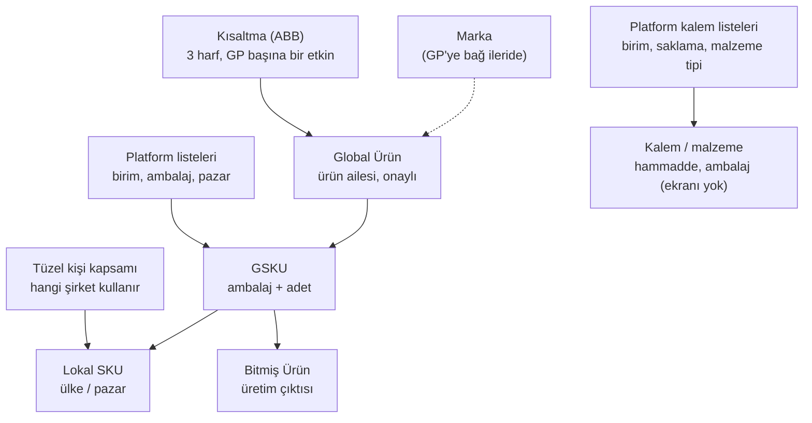
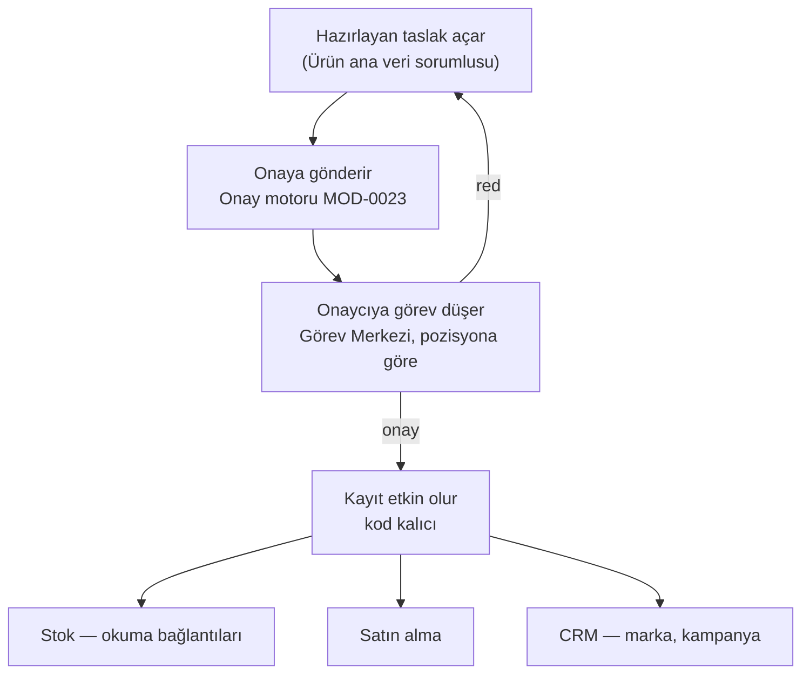

# MOD-0290 · Ürün / Kalem / SKU Ana Verisi — harita

Bu belge, sahibin 2026-10-09'daki sorusuna verilen cevabın kalıcı halidir: "nasıl yapılıyor, hangi sayfalar var,
nasıl bağlanacak". Kaynaklar:
- paketler `execution/domains/master-data-management/module-packs/MOD-0290-*` (takeover dalı);
- ekranlar `frontend/Diten.Web/Views/MasterDataManagement/*`, `MasterData/Brands`, `MasterData/Products`, `MDM/ProductAbbreviationRegister`.

Bir şey değişince bu belge güncellenir.

## 1. Kayıtlar ve bağları

| Kayıt | Ne | Bağı (paket §3) |
|---|---|---|
| Global Ürün | Pazardan bağımsız ürün ailesi; ad + sistem kodu; onayla etkin olur | Kök |
| Ürün tanım revizyonu | `REV-001`, `REV-002` … Ekranda ayrıca görünmez; ilk GSKU ile birlikte açılır | Global Ürün 1 → 0..* |
| GSKU | Global Ürünün ambalajlı şekli (ambalaj türü + adet + birim) | Revizyon 1 → 0..* |
| Lokal SKU | Bir GSKU'nun bir ülkede (pazar, ISO ülke kodu) kullanılan hali | GSKU 1 → 0..* |
| Bitmiş Ürün | Üretimden çıkan ürün kaydı | GSKU 1 → 0..*; Lokal SKU ile doğrudan bağı YOK |
| Kısaltma (ABB) | Global Ürün başına 3 harfli, tekrar kullanılmayan kısaltma | Global Ürün başına en çok bir etkin |
| Tüzel kişi kapsamı | Ürünün hangi şirketlerde kullanılabileceği (grup geneli / belirli şirketler) | Global Ürün başına bir politika |
| Marka | Ticari marka | Bugün "Ürünler" (CRM) ile bağlı; Global Ürüne bağı sonraki GP turunda (iş listesinde) |
| Kalem / malzeme | Hammadde ve ambalaj malzemesi; kalemin kendisi SKU'dur | Ayrı kayıt; kiracı geneli |

## 2. Onay akışı

## 3. Ekranlar

| Ekran | Adres | Ne yapılır | Durum (2026-10-09) |
|---|---|---|---|
| Global Ürünler | `/MasterDataManagement/GlobalProducts` | Ürün ailesi açılır, onaya gönderilir | Kod bitti; dev'e birleştirme sürüyor |
| GSKU'lar | `/MasterDataManagement/Gskus` | Global Üründen ambalajlı şekil | Aynı |
| Lokal SKU'lar | `/MasterDataManagement/Lskus` | GSKU'nun ülke hali | Aynı |
| Bitmiş Ürünler | `/MasterDataManagement/FinishedGoods` | Üretim çıktısı kaydı | Aynı |
| Ürün Tüzel Kişi Kapsamı | `/MasterDataManagement/ProductLegalEntityScopes` | Hangi şirket hangi ürünü kullanır | Aynı |
| Ürün Kısaltma Kaydı (ABB) | `/MDM/ProductAbbreviationRegister` | 3 harfli kısaltma | Aynı |
| Markalar | `/MasterData/Brands` | Marka, bağlı ürünler, dışa aktarma | Aynı (plana "Marka" modülü eklenmeli) |
| Ürünler (marka ürünleri) | `/MasterData/Products` | CRM tarafı basit ürün listesi | Var — bkz. açık soru 1 |
| Tüzel Kişiler | `/MasterData/LegalEntities` | Şirketler (MOD-0220) | Dev'de |
| Kalem / malzeme | — | Hammadde, ambalaj | Ekranı yapılacak (FU04 S5) |
| Görev Merkezi | `/WorkCenterNext` | Onaycı onayı burada verir | Dev'de |

## 3b. CRM bağlantısı (Marka / marka ürünleri)

Bugünkü bağlantı (`origin/main`):
- CRM segment doğrulayıcısı `GET api/mdm/brands/{id}` ve `api/mdm/products/{id}`'yi ağ geçidi üzerinden, kullanıcı belirteciyle okuyor (`Diten.CrmService.Infrastructure/Segmentation/MdmSegmentProductReferenceValidator.cs`).
- Bilgi içerikleri, ziyaret sıklığı politikaları ve kampanyalar `BrandId` / `ProductId` taşıyor.
- CRM marka yazmıyor.

Takeover'daki değişiklikler (tek PR'la gelir):
- marka izinleri kendi modülünde (`brand-product-master`, 9 anahtar);
- yeni bağ yalnız Etkin ve geçerlilik tarihi içindeki markaya (`brand_not_linkable`);
- detayda `isLinkable` / `liveProductCount`;
- güncelleme `expectedVersion` ister;
- sayfalı liste;
- 8 yeni hata kodu;
- dışa aktarma.

CRM'e gönderilen cevap (2026-10-09, sahip iletir):
- **Şartlar:** plana "Marka" modülü; CRM rollerinde `mdm.brands.read` / `mdm.products.read`.
- **Öneriler:** seçimde `isLinkable`; kodları sözleşme ucundan okumak; açık soru 1 kapanana kadar "Ürünler" kaydına yeni bağımlılık eklememek.

## 4. Sahibe sorulan açık sorular (2026-10-09)

| # | Soru | CT önerisi | Cevap |
|---|---|---|---|
| 1 | İki "ürün" var: Global Ürün (kimlik zinciri) ve Marka altındaki "Ürünler" (CRM listesi). Tek ürün kaydına inelim mi? | Evet. Marka Global Ürüne bağlanır, "Ürünler" sayfası zamanla Global Ürünün CRM görünümü olur. SAP'de tek malzeme ana kaydı vardır, marka onun bir özelliğidir; Oracle'da da tek item master vardır. | bekleniyor |
| 2 | Lokal SKU'nun ekseni ülke (pazar) mi, şirket (tüzel kişi) mi, ikisi birden mi? | Ülke zorunlu kalsın; satan şirket isteğe bağlı alan olsun (paket: şirket "açık karar"). | bekleniyor |
| 3 | Fason üretimde müşterinin ürünü için de bizde Global Ürün → GSKU → Bitmiş Ürün açılacak mı? | Evet; müşteri bilgisi sonra ayrı ilişki olarak eklenir. | bekleniyor |
| 4 | Bitmiş Ürün GSKU'ya bağlı, ülkeye değil. Ülkeye özel ambalaj (ör. Türkçe prospektüs) ayrı bitmiş ürün mü olmalı? | Ülkeye özel ambalaj ayrı GSKU olsun; bitmiş ürün de ona bağlansın. | bekleniyor |
| 5 | Canlıda Global Ürün / GSKU onayını hangi pozisyon verecek? | Kalite (QA) pozisyonu; dev'de senaryodaki Metin (CTO). | bekleniyor |
