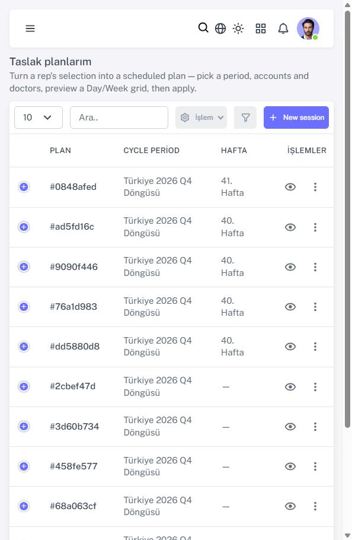
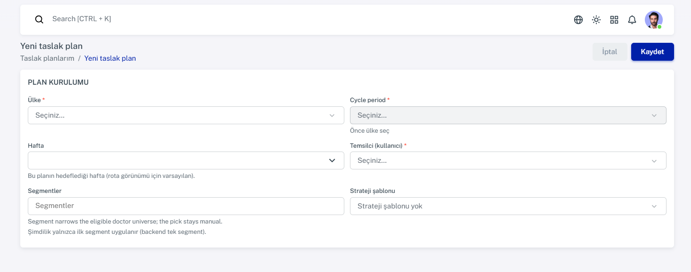
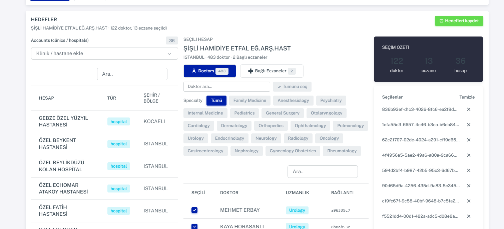
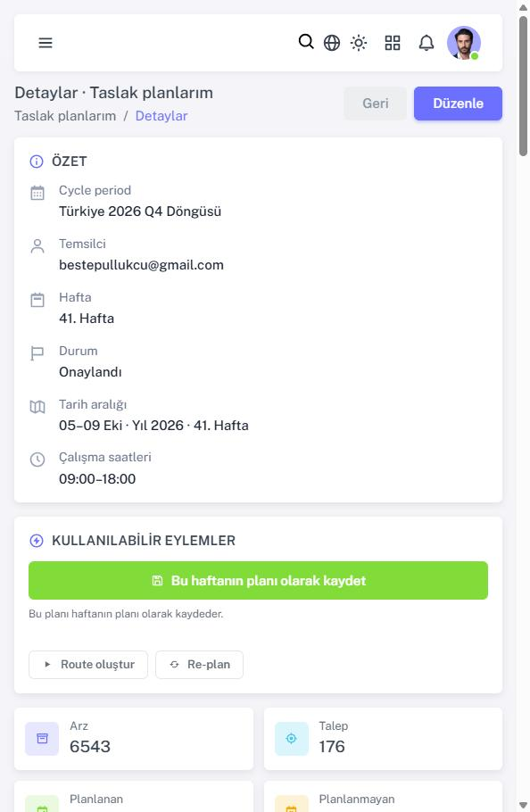
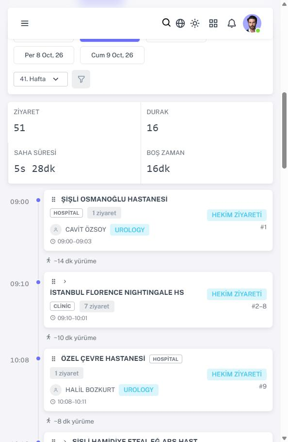
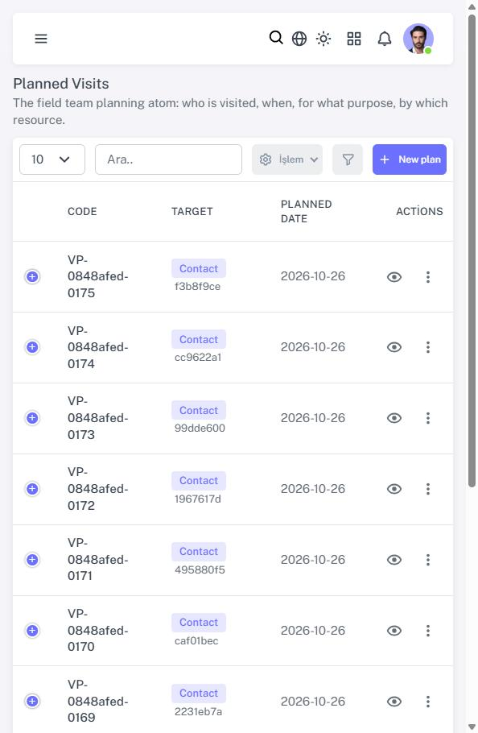

# Mobil ekiplere not — Ziyaret planlama kararları ve uyum listesi

> **Kime:** iOS ve Android ekipleri · **Kimden:** backend / Control Tower · **Tarih:** 2026-10-06
> **Kaynak:** Web'deki Ziyaret Planlama ve Planlanan Ziyaretler sayfalarının canlı incelemesi (97c5, yerel ortam) + ürün sahibinin bugünkü kararları.
> Ekran görüntüleri Web'den. Bazıları dar pencerede alındı, bu yüzden düzen mobile benziyor. Görüntülerde demo verisi (doktor adları) ve bir test kullanıcısının e-postası var; ekip dışına paylaşmayın.

## 1. Kısa özet
- Ürün sahibi **temsilcinin ekranı** için dört karar verdi (§2). Bu kararlar **mobil uygulamalar için de geçerli**.
- Bazı backend alanları **henüz yok** ama geliyor (§5). Gelene kadar mobilde yapılması / yapılmaması gerekenler §4'te.
- Sizden istenen: §4'teki listeyi uygulamalarınızla karşılaştırın, eksik ya da aykırı olanları düzeltin, §6'daki sorulara yanıt verin.

## 2. Kararlar (ürün sahibi, 2026-10-06)
| # | Karar | Mobil için anlamı |
|---|---|---|
| K-1 | Temsilci **kendi haftasını** planlar. İleride ayrı bir yönetici görünümü gelecek. | Temsilci seçimi yok: kaynak her zaman oturumdaki kişi (`resources/me`). |
| K-2 | Bir hafta planlanıp onaylanınca **sonraki haftalar doktorun / kurumun ziyaret sıklığına göre otomatik** oluşur. | Sonraki haftaların ziyaretleri backend'den **planlanmış ziyaret** olarak gelir (`source = route-plan`). Mobil bunları kendisi üretmez. |
| K-3 | Temsilci **strateji şablonu ("oyun") ve kampanya** görmez, seçmez. | Hiçbir ekranda bu kelimeler, alanlar ya da seçiciler olmaz. API'ye `strategyTemplateId` / `campaignId` gönderilmez; sunucu kendisi türetir. |
| K-4 | Temsilci **segment seçmez ve segmentle süzmez**. Sistem "**Bu hafta görülmesi gerekenler**" listesini önerir. Segment, doktor satırında yalnız **bilgi rozeti** olur. | iOS raporundaki "Segment — kapsam kararı yok" maddesinin cevabı bu: segment filtresi / kapsamı **yapılmayacak**. Yalnız rozet, alan geldiğinde. |

## 3. Web'de bugün ne var (ekran görüntüleri)
> Web ekranı yeniden tasarlanıyor (mockup aşamasında). Görüntüler bugünkü durumu ve bulunan sorunları göstermek için.

**3.1 Plan listesi** — temsilci e-postayla görünüyor; "Hedefler" sütunu hatalı (hep 0).

**3.2 Yeni plan formu** — "Temsilci", "Segmentler" ve "Strateji şablonu" alanları **kaldırılacak** (K-1, K-3, K-4).

**3.3 Hedefler** — temsilci hastaneyi, sonra doktorları ve eczaneleri seçiyor. "Seçilenler" listesinde ve "Bağlantı" sütununda **ad yerine GUID** görünüyor. Bu, mobilin istediği **D1 (görünen ad)** konusunun aynısı.

**3.4 Onaylanmış plan** — "Onaylandı" durumunda kaydet butonu hâlâ açık (hata, düzeltilecek). "Arz 6543" dönemin tamamı, "Talep 176" bu plan; birimler farklı.

**3.5 Rota** — gün gün duraklar. Tasarım **değişmeyecek**; mobil takvim / rota görünümü için iyi bir referans.

**3.6 Planlanan Ziyaretler** — hedef "Contact f3b8f9ce" gibi **GUID** ile görünüyor (D1).

## 4. Mobil uyum listesi — kontrol edin, eksikse düzeltin
| # | Kontrol | Beklenen |
|---|---|---|
| M1 | Strateji şablonu / oyun / kampanya | Hiçbir ekranda ad, alan ya da seçici yok. Oluştur / düzenle isteğinde `strategyTemplateId`, `campaignId`, `segmentId` **gönderilmez**. ⚠ Bugün sunucu bu alanları **kabul ediyor ve kullanıyor**: kampanya doğrulanıp kaydediliyor, strateji içerik çözümünde, segment sıklık çözümünde kullanılıyor. Sunucunun bunları kendisi türetmesi backend işi (§5); o zamana kadar göndermeyin. |
| M2 | Segment | Segment seçimi / filtresi / kapsamı **yok**. Backlog'daki segment işi kapanır. Rozet için alan gelince haber verilecek (§5). |
| M3 | Temsilci / kaynak | `resourceId` yalnız `GET /api/crm/resources/me`'den. Kullanıcı listesinden temsilci seçtiren ekran olmaz. |
| M4 | Hedef seçici (işyeri / kişi) | Bugün olduğu gibi çalışır. **Bölge ataması** uç noktası gelince (§5) yalnız temsilcinin bölgesindeki hedefler listelenir; bölge dışı ekleme uyarılı ayrı akış olur. |
| M5 | Haftalar | Mobil hafta / ziyaret **üretmez**. Sonraki haftalar backend'den planlanmış ziyaret olarak gelir. Mobilde elle oluşturma, plan dışı tekil ziyaret içindir (`source = manual`; T1–T3 sözleşmesi ayrıca gelecek). |
| M6 | Görünen ad (D1) | **GUID gösterilmez.** Alanlar gelene kadar: hedef türü etiketi + mevcut işyeri / kişi uçlarından ad (önbellekli), bulunamazsa "Ad yükleniyor / bilinmiyor". Alanlar gelince doğrudan onları kullanın (§5). |
| M7 | Sıklık | Planlanmış ziyarette `frequencyStatus` var: `resolved` / `unknown`. `unknown` hata değildir; "sıklık yok" bilgi rozeti gösterilebilir. Bugünkü demo verisinde çoğu `unknown`. |
| M8 | Süre | `plannedDurationMinutes` sunucudan geldiği gibi gösterilir; sabit süre varsayılmaz. Eski demo planlarında hepsi **3 dk** (eski hesap); yeni planlarda değişecek. |
| M9 | Hafta sonu / tatil | Takvim hafta sonu ziyaretini de **gösterebilmeli** (gizlemesin). Bugün backend bir Pazar ziyareti üretmiş durumda (`VP-0848afed-0176`, 2026-10-25); düzeltiliyor. |
| M10 | Onaylı hafta | Onaylanmış haftanın ziyaretleri planlama açısından salt okunur olacak. Ziyaret bazında onayla / iptal / rapor akışları aynı kalır. |
| M11 | Referans setleri | Yeni uç: `api/lookups/reference-data/consumable-sets/{setCode}/published-values` (main'de, PR #132). Eski `sets/{setCode}` kullanılmaz. Sunucuya dağıtıldığı ayrıca teyit edilecek. |
| M12 | Zarf / başlık | Yanıtlar `Response<T>` zarfında (`data.items`); `X-Tenant-Id` zorunlu. |

## 5. Backend'de gelecekler (alan adları **taslak**, kesinleşince sözleşme notu gönderilecek)
| İş | Mobil etkisi | Taslak alanlar |
|---|---|---|
| Sunucu türetmesi | strateji / kampanya / segment istemciden alınmaz, doktordan türetilir | istemciden gelen değer reddedilir ya da yok sayılır (karar backend'de) |
| D1 görünen adlar | liste / detay / takvimde ad | `targetDisplayName`, `accountDisplayName`, `contactDisplayName`, hedef pasifse işaret |
| B01 sahiplik | temsilci yalnız kendi ziyaretlerini görür / değiştirir (sunucu tarafında) | istemci değişikliği gerekmez; başkasının kaydı 404 / 403 |
| Sıklık uyumu | doktor başına dönem hedefi / yapılan / kalan, son ziyaret | `frequencyTarget`, `visitsDone`, `visitsRemaining`, `lastVisitDate` |
| "Bu hafta görülmesi gerekenler" | öneri listesi | yeni uç (temsilcinin bölgesi + sıklık + son ziyaret) |
| Bölge evreni | hedef seçicide yalnız kendi bölgesi | yeni uç / filtre (kaynak ↔ bölge modeli kararına bağlı) |
| Segment rozeti | bilgi rozeti | `segments: [{code, label}]` (salt okunur) |
| Takvim düzeltmesi | hafta sonu / tatile ziyaret düşmez, günler dengelenir | istemci değişikliği gerekmez |
| F-RBAC | saha temsilcisi rolü + ziyaret raporu yetkileri | yetki anahtarları değişmez (`crm.planned-visit.*`, `crm.visit-report.*`) |

## 6. Sizden yanıt beklenenler
1. Uygulamanızda bugün **strateji şablonu, kampanya ya da segment** görünen veya seçilen bir yer var mı? Varsa hangi ekran?
2. Planlanan ziyaret oluştur / düzenle isteğinizde `strategyTemplateId`, `campaignId` ya da `segmentId` gönderiyor musunuz?
3. Hedef adını bugün nasıl gösteriyorsunuz: GUID mi, ayrı istek mi?
4. Hafta sonu ve tatil günlerindeki ziyaretleri takvimde nasıl ele alıyorsunuz?
5. Haftalık planlamayı (hedef seçip haftayı onaylama) mobilde de istiyor musunuz, yoksa ilk aşamada yalnız görüntüleme + plan dışı tekil ziyaret yeterli mi?
