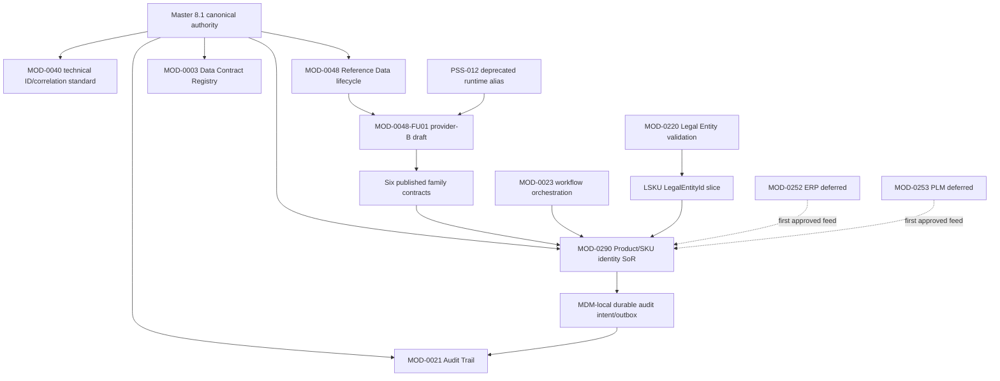

# DCP-004 — MOD-0290 SKU & Coding Foundation Readiness

> **Artifact type:** This is a Delivery Capability Pack governed by CAP-001. It is not a runtime entity, a Module Pack, a follow-up Module Pack, a product module or a MOD-0014 runtime Capability Group.
>
> **Authority rule:** By explicit user decision, `docs/System Capability & Implementation Blueprint - master 8.1.xlsx` is the sole Blueprint authority for MOD-0290 business, architecture, domain, field-model and Module Pack decisions. Master 7 is only a legacy verifier/tool-compatibility input and cannot determine MOD-0290 domain decisions or prove Master 8.1 alignment. Remaining Master 7 authority wording in AGENTS.md, approved DCP-002, the registry or verifier is visible governance cleanup, but it does not block DCP-004 approval or MOD-0290 Module Pack draft authoring. MOD-0040 canonical ID/correlation reconciliation remains a separate gate and is not waived by this authority decision.
>
> **Premature-coding guard:** DCP approval approves scope, ownership, sequence and gate closure paths; it is not
> technical-proof completion. Authorized implementation may begin only after the relevant Module Pack is `approved`
> and the user explicitly authorizes a named delivery step. That authorization is not production, integration,
> public-endpoint or release readiness: step-entry contracts must already be selected where required, unresolved gates
> cannot be bypassed, and G2-G8A evidence must close before the affected slice is enabled or promoted.
>
> **Authority chain:** This DCP is the formal approval artifact for the locked delivery architecture, scope, ownership,
> sequencing and gates. The supporting [MOD-0290 Domain Contract](../../domains/master-data-management/domain-contracts/MOD-0290-sku-coding-foundation-domain-contract.md)
> is a DCP-controlled detailed field/design elaboration; it is not an independent governance authority and cannot
> replace this DCP's approval. Neither artifact is a Module Pack or code-start authorization.

> **Superseding G2/G3 decision for two exact families (2026-08-07):** The user approved a hybrid reference-data
> architecture. `pack-applicability` and `uom` are MOD-0048-owned, global, code-owned and deployment-versioned
> universal lookups. They do not use a reference tenant, consumer assignment, Mongo catalog, seed/load/publish
> operation or governance-mode eligibility. Every earlier reference in this DCP to those mechanisms as mandatory for
> these exact two families is superseded. G2 for the two-family identity/catalog/precision contract closes through
> deterministic code version identities and contract tests; G3 retains authenticated S2S credential, independently
> validated tenant JWT, bounded timeout/failure envelope and MOD-0290 consumer evidence. Other steward-managed
> reference families and the generic BRD lifecycle are unaffected. This decision does not itself authorize First GSKU
> mutation, navigation or production enablement.

## 1. Identity and status

| Field | Value |
|---|---|
| ID | DCP-004 |
| Name | MOD-0290 SKU & Coding Foundation Readiness |
| Type | Delivery Capability Pack |
| CAP-001 status | `approved` |
| Primary business delivery | MOD-0290 Product / Item / SKU Master |
| Owner domain | master-data-management |
| Authoring branch | `feature/mdm/mod-0290-dcp-backlog` |
| Canonical Blueprint | Master 8.1 only |
| Code authority | None |
| Module Pack authority | None; a separately approved MOD-0290 Module Pack plus explicit user authorization is required for implementation, and later readiness promotion requires applicable technical evidence |

**Classification decision:** A normal MOD-0290 Module Pack is not sufficient by itself. The delivery crosses Reference Data, Audit, Workflow, Data Contract, Canonical ID/Correlation and Legal Entity ownership boundaries and includes external ERP/PLM deferrals. CAP-001 therefore requires this Delivery Capability Pack before Module Pack authoring and implementation. After DCP approval, canonical MOD-0290 registry identity reconciliation must close before the official Module Pack draft artifact is authored; this registry gate is distinct from repository-wide Master 7 cleanup and does not require G2-G8A technical/operational proof completion.

## 2. Business outcome

Establish a tenant-scoped Product/SKU identity foundation that provides governed business identities for Global Product, Product Definition Revision, GSKU, LSKU, Finished Good and MarketTradeName, supported by separately governed LegacyAlias and CodeReservation records. Canonical codes on the four code-bearing entities are immutable and non-reusable.

The first phase must provide:

- tenant-scoped ownership and uniqueness;
- system-generated, immutable, low-semantic canonical business codes;
- controlled Product/SKU identity approval with maker-checker separation;
- durable evidence for critical mutations;
- governed consumption of six business reference-data families;
- explicit parent/child approval and child-first retirement behavior;
- manual legacy onboarding in which legacy codes remain aliases rather than canonical codes.

## 3. Problem statement

Master 8.1 defines MOD-0290 as the canonical platform Product / Item / SKU Master and assigns it product, item, SKU, UoM mapping, identifier and item-lifecycle ownership. Since this DCP's original readiness assessment, the registry entry and Module Pack have been created and the user-authorized `CodeReservation common ledger + Global Product draft foundation` slice has entered implementation. This progress does not close the remaining G2-G8A readiness gates or authorize endpoint exposure.

The required first-phase behavior cannot safely be authorized through an isolated Module Pack because:

1. Master 8.1 MOD-0040 is the Canonical ID & Correlation Standard, while the registry currently uses MOD-0040 as a deprecated alias for MOD-0288 Organization. This must be reconciled or explicitly waived without transferring product business-code ownership to MOD-0040.
2. Master 8.1 MOD-0048 owns reference code-set lifecycle, but the current repo MOD-0048/PSS-011 pack is a narrow cross-tenant Platform lookup surface. PSS-012 is now recorded as MOD-0048's deprecated tenant-scoped runtime/provider alias, and draft MOD-0048-FU01 defines the shared provider-B hardening plan; neither fact makes the provider governance-ready for the six new families.
3. Existing MDM audit behavior forwards to Platform only after the business handler and swallows failure. It cannot prove that critical MOD-0290 mutations and an audit intent share one durable consistency boundary.
4. Workflow runtime exists, but MOD-0290 onboarding, service actor identity, maker-checker/SoD and lifecycle ownership are not contracted.
5. MOD-0220 can validate an LSKU LegalEntityId slice, but it is not a blanket prerequisite for every MOD-0290 aggregate.
6. Master 8.1 lists MOD-0003, MOD-0252 and MOD-0253 dependencies; their first-phase registration/deferral treatment must remain visible rather than silently disappearing.
7. Auth permission catalog/seed and Platform module-catalog/tenant-entitlement onboarding are not yet proven for
   MOD-0290; without them, correctly permissioned endpoints may still be operationally unreachable.

## 4. Capability boundary

### In-boundary orchestration

This DCP coordinates:

- MOD-0290 Product/SKU identity ownership and first-phase domain boundaries;
- canonical business-code policy versus technical correlation/interface identity;
- six-family reference-data hosting, publish, version and consumer contracts;
- MOD-0290-owned reference-data semantics and validation;
- MDM-local durable audit intent/outbox requirements and central audit consumption;
- MOD-0290 identity approval versus Reference Data publication workflow boundaries;
- LSKU LegalEntityId validation through the MOD-0220 referenceability contract;
- approved first-phase scoped deferral for MOD-0003, MOD-0252 and MOD-0253; a future usable MOD-0003 registration path requires a separate owner decision;
- explicit ERP/PLM external-feed deferral and re-entry criteria.

### Ownership boundary

MOD-0290 is the sole SoR for Product/SKU identity lifecycle and canonical Product/SKU business codes. It does not own:

- the MOD-0040 technical correlation/interface identifier standard;
- generic reference-set publish/version infrastructure;
- workflow definitions and run history owned by MOD-0023;
- central audit-event query/retention owned by MOD-0021;
- Legal Entity lifecycle owned by MOD-0220;
- data-contract registry lifecycle owned by MOD-0003;
- external ERP/PLM systems or their feeds;
- regulatory, composition, labeling, manufacturing, quality or GTIN lifecycle.

## 5. Member modules and follow-ups

### Delivery-classification rule

| Class | Meaning | Module Pack consequence |
|---|---|---|
| A | Existing module configuration or a published data contract is sufficient | No new Module Pack. Owner, version/publication, access and verification evidence are recorded here and in the consuming pack. |
| B | Existing provider module code, schema or durable contract must change | A separate owner-domain follow-up Module Pack is required after DCP approval. No follow-up ID is created by this DCP. |
| C | Adapter/consumer integration is within MOD-0290 responsibility | No automatic follow-up pack. Acceptance criteria and tests belong in the MOD-0290 Module Pack. |
| D | Owner or solution location for a cross-domain technical change is unresolved | Remains an explicit DCP decision/gate. No pack is created before ownership is decided. |

### Members, dependencies and provisional classification

**Direct Master 8.1 Blueprint dependencies:** `Dependencies!A1281:D1285` contains exactly MOD-0003, MOD-0040, MOD-0021, MOD-0252 and MOD-0253 as direct MOD-0290 edges.

**Delivery-derived / governance dependencies:** MOD-0048, MOD-0023 and MOD-0220 are real delivery gates derived from the accepted phase-one reference-data, workflow and LSKU LegalEntityId decisions. They are not direct MOD-0290 edges in `Dependencies!A1281:D1285`. This distinction changes evidence provenance only; it does not make these delivery gates optional.

| Capability/dependency | Dependency basis | Role | Current evidence | Provisional A/B/C/D | Closure effect |
|---|---|---|---|---|---|
| MOD-0290 | Primary delivery | Primary business delivery and Product/SKU identity SoR | Master 8.1 defines it; canonical registry entry and in-progress Module Pack exist, with authorized CodeReservation/Global Product/Candidate-B worker foundation runtime evidence. Other aggregates, API/controller and integration-dependent behavior remain absent/out of the current step | C for its own implementation | Canonical identity is closed. Subsequent aggregate/API/integration slices require their own Module Pack scope, applicable gate closure and explicit user implementation authorization; repository-wide Master 7 cleanup remains non-blocking governance work |
| MOD-0048 | Delivery-derived governance dependency | Master 8.1 Reference Data capability | Blueprint owns code sets/hierarchies/value lifecycle; repo pack is narrow PSS-011 system lookup; PSS-012 is its deprecated provider alias | Canonical identity is closed; the proven shared-provider change is B and MOD-0290 consumption is C | Draft MOD-0048-FU01 must close the applicable family provider contracts and technical evidence |
| Repo MOD-0048 / PSS-011 | Provider implementation evidence | Cross-tenant Platform system lookup implementation | `GlobalEntity`-style platform lookup boundary; not tenant business reference data | A only for its existing narrow surface | Must not be used as the six-family Product/SKU source |
| PSS-012 runtime alias | MOD-0048 provider implementation evidence | Tenant-scoped set/version/value/publish/usage implementation | User-approved legacy runtime/provider implementation alias of MOD-0048, recorded in the registry. Reusable runtime exists, but the two-family audit proves shared provider code/durable-contract gaps and production mode defaults to Disabled | B for shared provider behavior; MOD-0290 consumer integration is C | Canonical parent/alias path is closed. Draft `MOD-0048-FU01-enterprise-business-reference-data-provider.md` defines the provider hardening plan; G2/G3 evidence remains open |
| MOD-0021 | Direct Blueprint dependency | Central audit trail | Platform audit service and outbox facilities exist; current MDM forwarding is best-effort | C for MDM-local durable intent; B only if shared contract must change | The G4 design/test plan is required for Module Pack approval; durable-consistency proof is produced by the authorized implementation step and blocks readiness/release, not that step's start |
| MOD-0023 | Delivery-derived governance dependency, not a direct MOD-0290 Blueprint edge | Workflow definitions/runs/orchestration | Platform workflow runtime exists, but transition actor trust, canonical human-subject representation, S2S/delegated-subject onboarding, mandatory start idempotency and partial-write recovery/atomicity are not production-proven | B for the provider contract/runtime gaps; C for MOD-0290 lifecycle, fail-closed consumer and owner-selected decision-ingestion/reconciliation integration | The G5 model and safe contract close before workflow-dependent implementation starts; provider B and consumer C evidence close before that slice is integrated or promoted |
| MOD-0220 | Delivery-derived governance dependency, not a direct MOD-0290 Blueprint edge | LSKU LegalEntityId referenceability provider | Same-tenant, active and non-deleted validation exists; missing, cross-tenant and non-referenceable records return a non-leaking 404; the endpoint requires JWT plus `mdm.legal-entities.read` | A is possible for an owner-approved in-process contract inside Diten.MdmService; B is required only if HTTP/S2S or a durable provider contract must change; MOD-0290 binding, approval-time revalidation, failure mapping and tests are C | Blocks only the LSKU LegalEntityId slice, never Global Product, Product Definition Revision, GSKU or Finished Good foundation work |
| Auth permission catalog/seed | Delivery-derived operational dependency | Hosts and assigns approved permission keys | Existing MDM convention is `mdm.{resource}.{action}`; MOD-0290 keys are not yet owner-approved or seeded | External onboarding prerequisite; B only if Auth owner confirms durable provider change | Auth owner evidence must close before entitlement-dependent endpoint enablement, exposure or readiness; this DCP does not create provider work |
| Platform module catalog and tenant entitlement | Delivery-derived operational dependency | Makes the module discoverable and reachable only for entitled tenants | `ModuleCatalogItem` and tenant-entitlement runtime exist; MOD-0290 onboarding evidence is absent | External onboarding prerequisite; B only if Platform owner confirms durable provider change | Platform owner evidence must close before entitlement-dependent endpoint enablement, exposure or readiness; MOD-0290 consumes the decision as C |
| MOD-0040 | Direct Blueprint dependency | Technical Canonical ID & Correlation prerequisite | Master 8.1 meaning conflicts with current registry alias | D | Reconciliation or scoped, owned and expiring waiver required |
| MOD-0003 | Direct Blueprint dependency | Data Contract Registry prerequisite | Master 8.1 dependency; registry says planned/missing; no Module Pack, runtime or usable registration endpoint exists. MOD-0002 Interface Registry stores lightweight interface metadata and contract names only; its pack explicitly excludes Data Contract Registry ownership and it has no schema/hash/compatibility-policy SoR | D with the approved scoped deferral for this first phase. A future usable MOD-0003 registration path is reconsidered only by a separate owner decision | The valid scoped deferral permits only internal Product/SKU foundation delivery with no runtime external publication; it never proves MOD-0003 runtime compliance |
| MOD-0252 | Direct Blueprint dependency | ERP external system / External SoR dependency | Master 8.1 lists ERP as a direct dependency; no ERP Product/SKU feed client, worker, gateway route or runtime contract exists in the searched repo | D with the approved ERP scoped deferral | Not a phase-one code-start blocker only for delivery steps with no ERP ingestion, distribution or feed; source/consumer direction and object scope close when a trigger occurs |
| MOD-0253 | Direct Blueprint dependency | PLM external system / External SoR dependency | Master 8.1 lists PLM as a direct dependency; no PLM Product/SKU feed client, worker, gateway route or runtime contract exists in the searched repo | D with the approved PLM scoped deferral | Not a phase-one code-start blocker only for delivery steps with no PLM ingestion, distribution or feed; source/consumer direction and object scope close when a trigger occurs |

**Follow-up and waiver guard:** The six families do not create six provider packs or identities. User approval records PSS-012 as a legacy runtime/provider implementation alias of canonical MOD-0048; the distinct PSS-011 Platform system-lookup surface is not merged into business reference data. The single canonical owner-domain follow-up `MOD-0048-FU01` now exists as a draft planning artifact for the common provider hardening. Draft authoring does not claim production readiness, authorize runtime work or bypass the remaining G2/G3 evidence. MOD-0023 provider behavior is likewise evidenced as Class B for the common trusted-actor, S2S/delegated-subject, mandatory-idempotency and partial-write recovery/atomicity gaps; any owner-domain follow-up is evaluated only after DCP approval and owner acceptance, with no ID created here. MOD-0220 remains conditional: an owner-approved in-process contract can close as A without a provider pack; HTTP/S2S or durable provider-contract changes classify as B and are evaluated by the MOD-0220 owner only after topology and ownership decisions close. MOD-0290 adapter/consumer work remains Class C in its own Module Pack. A/B/C/D classification changes the delivery mechanism only; it never waives or removes a direct Blueprint dependency or a delivery-derived governance gate.

## 6. Ownership map

| Object or contract | SoR / accountable owner | Consumer boundary |
|---|---|---|
| Global Product | MOD-0290 | Referenced by explicit ID |
| Product Definition Revision | MOD-0290 | Consumers use explicit RevisionId; no automatic current revision in phase one |
| GSKU | MOD-0290 | Product/SKU identity and code |
| LSKU | MOD-0290 | Owns MarketTradeName and responsible commercial LegalEntityId reference |
| Finished Good | MOD-0290 | Must reference exactly one GSKU |
| MarketTradeName and former-name history | MOD-0290 | LSKU + market + approved language + effective timeline |
| LegacyAlias | MOD-0290 | Search/migration alias only; separate authorized-steward `ACTIVE → RETIRED` lifecycle; never canonical output |
| CodeReservation and canonical Product/SKU code | MOD-0290 | Immutable, system-generated, no-reuse |
| Technical correlation/interface identifier standard | Master 8.1 MOD-0040 | MOD-0290 adopts the contract after reconciliation/waiver |
| Reference code-set lifecycle | Master 8.1 MOD-0048 owner | PSS-012 alias and Diten.Platform delivery placement are recorded; production-safe publisher behavior remains gated |
| Six-family hosting/publish/version | MOD-0048 owner through draft follow-up MOD-0048-FU01 | PSS-012 is the deprecated runtime/provider alias; G2/G3 provider evidence remains open |
| ProductType applicability and Product/SKU validation | MOD-0290 | Consumes published controlled values |
| UoM hosting | Reconciled Reference Data owner | Governed value-set hosting only |
| UoM mapping and Product/SKU business semantics | MOD-0290 | Master 8.1 SoR_Map assigns UoM mappings to MOD-0290 |
| Workflow definitions and run history | MOD-0023 | MOD-0290 remains identity-state SoR |
| MDM-local durable audit intent/outbox | MOD-0290 delivery boundary | Forwarded/consumed by MOD-0021 without losing local durability |
| Central audit events, retention and export | MOD-0021 | Does not replace local mutation consistency proof |
| Legal Entity referenceability | MOD-0220 | LSKU slice performs same-tenant active/referenceable validation |
| Internal data-contract governance | MOD-0003 | First phase uses the approved scoped deferral because no usable registration path exists; MOD-0002 lightweight interface metadata does not close the MOD-0003 gate |
| Permission catalog/seed | Auth owner | MOD-0290 declares and enforces approved endpoint permissions; provider seeding is not MOD-0290-owned |
| Module catalog and tenant entitlement/onboarding | Platform owner | MOD-0290 consumes effective entitlement; Platform owns catalog and tenant reachability evidence |

### Six-family reference-data ownership

| Family | Hosting/publish owner | MOD-0290 semantic responsibility | Required contract before code start |
|---|---|---|---|
| ProductType | Reconciled MOD-0048 Reference Data provider | Applicability and validation rule selection | Exact SetCode, tenant scope, schema/attributes, published version, access and failure behavior |
| DosageForm | Same | Product Definition presentation identity | Same |
| RouteOfAdministration | Same | ProductType-dependent applicability and controlled list | Same |
| StrengthRepresentationType | Same | Limits scalar descriptor to SIMPLE_STRENGTH or SIMPLE_CONCENTRATION | Same |
| UoM | MOD-0048 global code-owned versioned lookup | UoM mapping, allowed dimensional use and Product/SKU semantics | Exact five values, precision matrix, deterministic version evidence, authenticated contract and failure behavior |
| PackApplicability | MOD-0048 global code-owned versioned lookup | User-approved enterprise-global semantic contract: SetCode `pack-applicability`, only `SCALAR_QUANTITY_APPLIES`, requiring the PackQuantity/PackUomCode tuple | Deterministic version evidence, authenticated contract and failure behavior |

None of these families may be hardcoded, accepted as free text, published through Mock mode or treated as production-ready through Disabled workflow behavior. The local service does block a submitter from approving the same record; however production workflow actor identity, S2S permission, durable maker-checker and external-workflow SoD are not yet proven.

Exact SetCode, scope encoding, value catalog, attribute schema and initial values remain owner-approved contract decisions for the families that are not yet selected. **User-approved GSKU entry contract:** enterprise-global business semantics; PackApplicability SetCode `pack-applicability` with only `SCALAR_QUANTITY_APPLIES` initially; UoM SetCode `uom` with initial ValueCodes `C62`, `GRM`, `KGM`, `MLT` and `LTR`. The MOD-0048/PSS-012 parent/alias identity and Diten.Platform delivery placement are recorded, but these decisions do not settle provider runtime scope encoding, publication state, version/pin/as-of, attribute schema, access or production readiness. Quantity-free/kit/hierarchy cases remain BL-017; tenant-specific semantic overrides are prohibited, although tenant access/assignment remains a separate provider contract. Reference Data may host governed UoM values; UoM mapping and Product/SKU business semantics remain in the MOD-0290 SoR.

**Additional user-approved provider contract direction:** enterprise-global semantics are physically served through a reference-tenant canonical catalog with server-side tenant assignment; tenant-local semantic overrides are forbidden. The reference tenant is configured only through a dedicated server-side provider option, with no default and no client/header override; catalog-load/seed options are not the access-control authority. A distinct durable `BusinessReferenceDataTenantAssignment` provider record, physically owned under the reference tenant, grants a consumer tenant access to one SetCode and no semantic mutation right. Its uniqueness scope is reference tenant + consumer tenant + SetCode among non-deleted records. The selected initial UoM metadata is `C62` → `COUNT`, maximum decimal precision `0`; `GRM`/`KGM` → `MASS`, maximum decimal precision `3`; `MLT`/`LTR` → `VOLUME`, maximum decimal precision `3`. Stable provider mapping direction is non-leaking set/value/access absence `404`; pin/retired/schema/contract conflict `409`; Disabled/Mock or provider unavailable `503`; timeout `504`; invalid or unauthenticated credentials `401`, authenticated but unauthorized credentials `403`. The implementation pack must define exact `Response<T>` error codes and prove these outcomes. This decision does not authorize runtime code, seed/publish, API exposure, or production enablement.

**Further user-approved closure for the two-family provider contract:** the authenticated consumer tenant is captured from the trusted server-side tenant context before any temporary reference-tenant data scope begins; request/header tenant values are never authoritative. Assignment lookup is exactly `ReferenceTenantId + captured ConsumerTenantId + SetCode + ACTIVE + !IsDeleted`. Invalid provider configuration does not fail the entire Platform host: provider readiness is unhealthy and every affected provider endpoint fails closed with `503 REFERENCE_PROVIDER_CONFIGURATION_INVALID`. Exact authorization envelopes require the Platform JWT challenge/forbid and permission-result path to return the existing `Response<T>` contract: unauthenticated `401`, authenticated-but-forbidden `403`. Existing `Consumer.Read`, `Usage.Register`, `Version.Submit`, `Version.Approve` and `Version.Publish` boundaries remain; `Platform.BusinessReferenceData.Assignment.Manage` is the separate assignment-administration permission and may not be combined with consumer, steward or publisher authority. Publish consistency uses an idempotent recovery/reconciliation state machine rather than an unproven Mongo transaction topology; no published pointer claim occurs before the required writes are confirmed. In the first two-family delivery, a draft may resolve `latest`, but submit/approval persists a catalog version pin; `as-of` and scheduled effective-period behavior are deferred. Retired values reject new selection, historical pinned records remain resolvable, replacement is optional within the same set and ValueCodes are never reused.

**Final user-approved provider design closure:** `REFERENCE_UNAUTHENTICATED` and `REFERENCE_FORBIDDEN` are endpoint-scoped BRD authorization envelopes. Only explicitly marked Business Reference Data endpoints may opt into those codes through endpoint metadata; the shared Platform JWT challenge and permission paths retain their existing contract for every unmarked endpoint. Durable publish recovery persists a separate `BusinessReferenceDataPublishOperation` owned under the reference tenant. It includes operation identity, SetId, VersionId, idempotency key, lifecycle state, checkpoint, expected published-pointer context, retry/error evidence and audit timestamps. A non-deleted unique index on `ReferenceTenantId + IdempotencyKey` prevents conflicting replay. No state machine transition may claim publication before re-reading and confirming the required durable writes. `Platform.BusinessReferenceData.Assignment.Manage` is enforced by a real assignment-administration action and its controller-reflection onboarding path; it is not added to a frontend-route-only manifest without an actual UI action. `approved` records governance acceptance only; for this pack runtime code starts only after status `ready-for-dev`, the named delivery step, its explicitly listed pre-code owner gates and separate user authorization are all present.

**User-approved first GSKU construction boundary:** Product Definition Revision is not independently created as an empty structural record in the first delivery. One idempotent first-GSKU draft command creates the explicit Revision and its first GSKU together; no standalone Revision create or edit surface exists in that delivery. The revision establishes the immutable parent/version boundary while the first GSKU supplies the meaningful initial draft presentation (`PackApplicability`, quantity and UoM). Product Type, Dosage Form, Route and Strength remain deferred until their governed reference-data contracts are approved; no free-text or local substitute is introduced.

**User-approved GSKU reference and recovery contract:** GSKU persists two embedded `ReferenceCatalogSelection` records, one each for `pack-applicability` and `uom`. Each contains `SetCode`, `ValueCode`, `CatalogVersionId`, `CatalogVersionNumber`, `ResolutionMode` and `ResolvedAtUtc`; provider-derived version fields are never client-authored. Draft resolution may be `LATEST` and refreshable. Submit/approval transitions the resolved evidence to immutable `PINNED`. The combined Revision/GSKU command uses one immutable `CreationCommandId` across both records and the existing GSKU CodeReservation idempotency flow. A partial or ambiguous write is reconciliation-pending; replay completes the same pair and must never create a second Revision, ordinal or GSKU.

**User-authorized provider code-start boundary:** the first MOD-0048-FU01 runtime step is `BRD Provider Internal Foundation`. It is limited to the existing PSS-012 provider’s internal options, durable tenant-assignment and publish-operation entities/repositories/indexes, DI registration and internal unit/real-Mongo tests. It creates no seed or catalog publication, provider-dependent resolve endpoint, assignment administration endpoint, gateway route, browser/UI surface, health endpoint enablement, S2S consumer exposure or production readiness claim. The FU01 Module Pack must move to `ready-for-dev` only with an exact allow-list limited to that step; all later provider runtime, auth, readiness, publish and consumer-exposure gates remain fail-closed.

## 7. Dependency graph

The graph expresses dependencies, not automatic provider Module Packs. Every edge is classified A/B/C/D before a delivery artifact is created.

## 8. Ordered delivery sequence

1. Review this DCP's boundary, owners, sequence, dependency provenance, classifications, gates and closure paths. This does not complete technical proof.
2. Apply the user-approved authority rule: Master 8.1 alone governs MOD-0290 business, architecture, domain, field-model and Module Pack decisions. Track AGENTS.md, DCP-002, registry and verifier Master 7 wording as non-blocking governance cleanup; never use a Master 7 verifier result as Master 8.1 evidence. Keep MOD-0040 reconciliation as a separate gate before a dependent implementation step starts and before readiness.
3. Approve this DCP's governance boundary, owners, order and closure paths. DCP approval does not assert G2-G8A technical/operational proof completion.
4. After DCP approval, have the Enterprise Architect and Registry owner complete the canonical MOD-0290 registry entry/identity reconciliation; then author the official MOD-0290 Module Pack draft and place all applicable G2-G8A requirements into explicit acceptance criteria and test plans. This registry gate is not repository-wide Master 7 cleanup. Only proven Class B provider changes receive separate owner-domain Module Packs.
5. Preserve the resolved identity relationship: MOD-0048 is canonical, PSS-012 is its deprecated runtime/provider alias, and PSS-011 remains the separate Platform system-lookup surface. Shared-provider behavior is Class B and MOD-0290 adapter/consumer integration is Class C.
6. Review and approve the single draft owner-domain follow-up `MOD-0048-FU01` for the proven shared-provider gaps. Do not create six family-specific packs; draft approval remains separate from runtime implementation authorization.
7. Define and verify the owner-approved SetCode, scope encoding, value catalog, initial values, attribute schema, version/pin/as-of, retirement/replacement/no-reuse and consumer failure contract for each family. Audit examples are not canonical SetCodes.
8. Prove that the selected provider path technically blocks Mock or Disabled publication for these six new families. Preserve the existing local self-approval guard and prove production workflow actor identity, S2S permission, durable maker-checker and external-workflow SoD.
9. Define and prove separate onboarding contracts for Reference Data publication workflow and MOD-0290 identity approval workflow. For G5, classify the audited MOD-0023 trusted-actor, canonical-human-subject, S2S/delegated-subject, mandatory-start-idempotency and partial-write recovery/atomicity gaps as provider B; classify MOD-0290 lifecycle ownership, required-workflow fail-closed enforcement, expected aggregate version, workflow binding, selected inbound-callback or pull/poll decision ingestion, idempotency/reconciliation, state transition and G4 intent as consumer C. The owners must select the ingestion model before that slice starts.
10. Close G4 without assuming production topology. Prove critical mutation + local durable audit intent, common-ledger reservation allocation/consume consistency, terminal burned-reservation evidence and expected-version concurrency together. Evaluate the topology-independent first-phase candidate in which business mutation and an append-only audit-intent payload are persisted in the same aggregate document by one Mongo write, while the one-way reservation invariant prevents identity-without-consume and preserves burned codes after failed identity writes. This is a recommendation to prove, not an approved implementation decision. If production and CI later prove transaction-capable replica-set/sharded topology, re-evaluate a separate MDM-local outbox collection plus Mongo transaction as the cleaner long-term candidate.
11. Close the LSKU LegalEntityId topology and contract decisions. Accept an owner-approved in-process MOD-0220 validation contract as A, or classify HTTP/S2S or durable provider-contract changes as owner-domain B; in either case record MOD-0290 binding, create/change/submit/approval revalidation, failure mapping, historical-reference behavior, cache/race controls and tests as C. Any B delivery must close before the LSKU LegalEntityId slice starts, but G6 does not stop unrelated MOD-0290 aggregate work.
12. Record the approved scoped deferral for MOD-0003, MOD-0252 ERP and MOD-0253 PLM. Its scope is limited to internal Product/SKU foundation delivery with no external ERP/PLM ingestion, distribution, feed, client, worker, gateway route or runtime external contract publication. The owners are Product Data Owner, Enterprise Architect and Integration Owner.
13. End the deferral at the first approved external-feed use case, external consumer/runtime publication need, cross-module contract consumer or breaking schema/version change. Before code starts in the triggered scope, close the named source/consumer, direction, object scope, SoR/conflict policy, credential owner, security, idempotency, retry, reconciliation, observability and relevant delivery artifact.
14. Preserve manual legacy onboarding and LegacyAlias in phase one; bulk migration remains BL-023. BL-025 and BL-026 remain deferred runtime work and do not substitute for the G7 governance record.
15. Approve the MOD-0290 Module Pack when its design, scope, owned objects, protected paths, API/field/failure
    contracts, test plan and per-gate owner/delivery-step closure map are approved. Implementation-produced evidence,
    including G4 real-Mongo proof, is not a Module Pack approval prerequisite.
16. Begin only an explicitly user-authorized implementation step under an `approved` Module Pack. A step may create
    the implementation and tests needed to produce its evidence, but it may not activate an unresolved dependency,
    claim production readiness or introduce Mock/Disabled/insecure fallback. G5 selection precedes workflow-dependent
    implementation; exact G2 contracts precede production reference validation; G8A precedes entitled endpoint
    enablement or gateway/public exposure.
17. Close Auth-owner permission catalog/seed evidence, Platform-owner `ModuleCatalogItem` and tenant-entitlement/onboarding evidence, and MOD-0290-owner endpoint enforcement evidence for the finalized permission contract before the affected endpoint slice is enabled or promoted.
18. Promote a delivery slice to `ready-for-dev`, integration, merge/release or production readiness only after the
    applicable G2-G8A evidence is complete. G4 completion includes real-Mongo atomicity, expected-version concurrency,
    crash/recovery and durable-audit proof. Under G7, any implementation remains inside the approved deferral scope.

## 9. Prerequisites

- Master 8.1 evidence baseline: `Blueprint_Data`, `Dependencies` and `SoR_Map` ranges listed in §20.
- DCP-004 identity collision check completed; no existing DCP-004 file/reference found at authoring start.
- Existing BL-015–BL-027 deferrals retained as backlog, not misrepresented as current implementation gates.
- The user-approved Master 8.1 authority rule is recorded. Remaining Master 7 wording stays visible as governance cleanup; neither cleanup completion nor a waiver is a DCP approval or Module Pack draft-authoring prerequisite.
- MOD-0290 identity and registry reconciliation owner assigned.
- MOD-0040 reconciliation/waiver owner and expiry path assigned.
- Reference Data owner, Product Data owner, Workflow owner, Audit owner, MOD-0220 owner, Data Contract owner and Integration owner identified.
- No claim that legacy migration is ready: no real legacy product/code export has been supplied.

## 10. Architecture decisions

### Product/SKU identity and code

- MOD-0290 and canonical-code uniqueness are tenant-scoped.
- Global Product, GSKU, LSKU and Finished Good are the only phase-one code-bearing entities and share one tenant-wide canonical-code namespace.
- Canonical business code is immutable and system-generated using an immutable entity-type prefix plus an opaque sequence.
- A common CodeReservation ledger owns uniqueness on `TenantId + ReservedCode` independently of entity type. `EntityType` may select the allocator/prefix but is never a uniqueness partition.
- Every code-bearing identity must prove exactly one matching same-tenant consumed reservation. Direct code assignment, manual override and reservation bypass are prohibited.
- A reservation may have zero or one consumed identity. Because cross-collection transaction topology is not proven, an ambiguous identity creation/write outcome remains reconciliation-pending and is never automatically burned from an absence lookup; the code remains permanently unavailable and requires durable failure reason, audit and recovery evidence. A terminal burned reservation without identity requires a deterministically proven pre-insert failure or a separately owner-approved persistent fence/transaction mechanism.
- Product, pack, site, manufacturer, country, market, MA, lifecycle status and changeable organization segments are not encoded in canonical codes.
- A consumed canonical code is never reused. Cancelled/expired reservations must preserve no-reuse evidence according to the future Module Pack's code policy.
- Legacy codes are LegacyAlias inputs only and never replace the canonical code.
- MOD-0040 technical correlation/interface identity is distinct from the MOD-0290 business code.

These are locked DCP architecture decisions. The supporting MOD-0290 Domain Contract owns their detailed cardinality,
field and validation elaboration but cannot weaken or independently approve them.

### GMG-SCM-SOP-0001 alignment boundary

GMG-SCM-SOP-0001 is a business/policy dependency for future material, formulation, artwork and registered-product
coding, governed by DCP-005. Its meaningful, revision-bearing examples (`FPF-...-V1`, `FPP-...-V1`,
`BX/LB/LF-...-V1`) are not the low-semantic MOD-0290 `CanonicalCode`, the aggregate technical `Id`, or the
MOD-0290 Product Definition `RevisionIdentifier`. A future owner-approved contract must distinguish permanent
internal UID, internal canonical code, SOP-controlled base code, controlled revision and legacy/commercial alias.

The current Global Product / first-GSKU internal foundation may continue under this DCP's existing gates because it
does not issue SOP-controlled FPF, FPP or artwork codes. DCP-005 is not a blanket blocker for that delivery. The
concrete stop condition is any attempt to emit or persist SOP-controlled codes/revisions through current
`CanonicalCode`/`RevisionIdentifier`, add Composition, MA, Registered Presentation or artwork scope, or assume an
unapproved one-to-one mapping between FPF/FPP and Product Definition/GSKU/LSKU/Finished Good.

This alignment does not change MOD-0048-FU01 provider delivery, AuthService S2S, or the existing GSKU reference-data
catalog step. Those remain governed by their current contracts and are only recorded as dependencies if a later
approved member delivery consumes them.

### Cardinality and aggregate boundary

- Finished Good references exactly one GSKU.
- A GSKU may reference zero-to-many Finished Goods.
- LSKU and Finished Good have no direct phase-one relationship. Future linkage is through Market Supply Assignment (BL-018).
- MarketTradeName belongs to LSKU and does not name Global Product or GSKU.
- Product Definition/GSKU does not persist a Composition ID, FK or placeholder in phase one.
- FPF is not automatically Product Definition Revision or GSKU; FPP is not automatically LSKU or Finished Good.
  Those mappings remain explicit DCP-005 decisions, and the direct LSKU-Finished Good prohibition remains in force.

### Strength presentation descriptor

- Phase one stores only a scalar presentation descriptor: numeric value + controlled UoM + controlled StrengthRepresentationType.
- Supported representations are SIMPLE_STRENGTH and SIMPLE_CONCENTRATION.
- No substance, ingredient, active-moiety, composition, formula or quantity-per-ingredient reference is stored.
- Complex/multi-active records may remain DRAFT but cannot enter identity approval.
- When a future Composition SoR is approved, the scalar descriptor becomes derived/read-only under BL-015 rather than becoming a competing Composition SoR.

### Lifecycle, maker-checker and retirement

- Product identity lifecycle is `DRAFT → PENDING_IDENTITY_APPROVAL → IDENTITY_APPROVED → RETIRED`.
- LegacyAlias is excluded from that lifecycle and uses only `ACTIVE → RETIRED`; attach and retire require an authorized steward and critical durable audit evidence.
- Product Data Steward submits; a distinct Product Identity Approver approves or rejects. Self-approval is prohibited.
- Reject returns the record to DRAFT with reason and audit evidence.
- Product Definition Revision may be Identity Approved only when its Global Product is Identity Approved.
- GSKU may be Identity Approved only when its Product Definition Revision is Identity Approved.
- LSKU and Finished Good may be Identity Approved only when their GSKU is Identity Approved.
- A retired parent is not referenceable for new child creation or new approval.
- No automatic cascade retirement is allowed. Identity Approved children block parent retirement; children retire first through controlled actions. Draft children require controlled cancellation.
- `IDENTITY_APPROVED` guarantees identity, code, duplicate and basic master-data integrity only. It does not guarantee regulatory, market, manufacturing, quality or commercial readiness.

### MarketTradeName history

- MarketTradeName is identified within LSKU, market and an approved market-language code.
- An approved name is not overwritten. A replacement is proposed in DRAFT and does not alter the approved timeline.
- On replacement approval, the old approved row is closed and the new approved row enters the half-open timeline `[EffectiveFrom, EffectiveTo)` in one controlled transaction/workflow; overlap is always rejected. Timeline granularity and any no-gap rule remain open owner decisions, so gap rejection is conditional rather than a locked first-phase invariant.
- Rejection/cancellation leaves the existing approved name unchanged. Former names remain searchable and auditable.
- Nitop → Nitopin in one market is a MarketTradeName replacement, not a new Global Product or GSKU. Each approved market language has a separate row.
- Official downstream-use event ownership remains deferred to BL-024; phase one does not add a synthetic `IsUsed` field.

### Reference Data, workflow and audit

- Reference values are published controlled codes, not hardcoded arrays or free text.
- Reference Data publication lifecycle and MOD-0290 identity lifecycle are separate integrations and SoRs.
- MOD-0290 remains identity-state SoR even if MOD-0023 orchestrates tasks, SLAs or approvals.
- This DCP does not retrospectively change the governance behavior approved in the existing PSS-012 pack. For the six new MOD-0290 families, however, Disabled or Mock publication cannot establish production readiness; scoped production-safe provider behavior must be proven through the accepted Class B delivery path.
- Required audit direction is MDM-local durable audit intent/outbox in the same consistency boundary as each critical mutation, followed by reliable delivery to MOD-0021.
- Best-effort forwarding and synchronous fail-closed remote append alone do not satisfy the durability requirement.

### G5 workflow, S2S actor and maker-checker direction

- MOD-0023 is a delivery-derived governance dependency for MOD-0290, not one of the direct Master 8.1 MOD-0290 dependency edges. It owns workflow definitions, tasks, assignments, SLAs and run history; it does not own Product/SKU identity state.
- Reference Data publication workflow and MOD-0290 identity approval workflow are separate contracts. The PSS-012 in-process submitter self-approval guard is limited reuse evidence only; it neither supplies the MOD-0290 workflow nor proves production S2S actor, delegated human subject, callback or durable maker-checker behavior.
- **Provider Class B:** trusted authenticated transition actor, one canonical human-subject representation for starter/maker/approver, transport-service versus delegated-human-subject separation, least-privilege S2S contract, mandatory workflow-start idempotency and start/transition partial-write recovery or proven atomicity.
- **MOD-0290 Class C:** aggregate lifecycle SoR, expected aggregate version, workflow instance/version binding, required-workflow fail-closed enforcement, the owner-selected authenticated inbound-callback or secure pull/poll decision-ingestion adapter, tenant/SoD/version/state revalidation, idempotency, reconciliation, own state transition and G4 local audit/workflow-start intent.
- A generic `NoWorkflow` / `NotApplicable` result cannot authorize `PENDING_IDENTITY_APPROVAL -> IDENTITY_APPROVED`. MOD-0290 must enforce required-workflow presence and an approved terminal decision fail-closed. If the generic Platform gate is also strengthened, that is additional provider B assurance rather than a replacement for the consumer invariant.

**Inbound decision-boundary evidence and open choice:**

The current MDM `TenantResolutionMiddleware` bypasses only OPTIONS, health, Swagger and favicon traffic. It has no
trusted inbound workflow-callback endpoint or tenant-resolution contract. Platform internal controllers demonstrate
key-gated S2S patterns, but those provider-local patterns do not establish an MDM callback contract and must not be
copied by trusting a raw tenant header or self-declared request-body tenant.

Before workflow-decision ingestion code starts, the Workflow owner, Product Data owner, MDM owner and Security owner
must choose one of two models:

1. **Authenticated inbound callback:** requires trusted service identity, distinct delegated human-decision identity,
   trusted tenant binding, least-privilege authorization, stable idempotency, replay protection and reconciliation.
2. **Secure pull/poll plus reconciliation:** MOD-0290 retrieves decisions using an approved least-privilege S2S
   credential, binds them to workflow instance/version and expected aggregate version, and reconciles missed or
   repeated observations without trusting caller-supplied tenant identity.

No `/api/internal` bypass is selected by this DCP. If the chosen model requires a shared MDM tenant middleware or
shared-infrastructure change, that work is not automatically MOD-0290 Class C; its owner, delivery classification and
approval artifact must be decided separately before implementation.

**Common choreography constraints, not implementation authorization:**

1. MOD-0290 accepts `DRAFT -> PENDING_IDENTITY_APPROVAL` together with its G4 local audit intent and workflow-start intent in its selected/proven local consistency boundary.
2. A worker starts the MOD-0023 instance with the same stable idempotency key.
3. MOD-0023 records a decision from a trusted human approver; the transport service identity is not treated as the approver.
4. The selected authenticated callback or secure pull/poll boundary delivers expected aggregate version, workflow instance/version, correlation, causation, sequence and human-decision-actor evidence to MOD-0290.
5. MOD-0290 revalidates tenant, maker-checker/SoD, expected version and current state before applying its own approval or rejection transition and G4 audit intent.
6. Timeout, lost acknowledgement or duplicate callback/poll observation cannot cause a second aggregate transition. Orphan workflow, partial start and approved-without-aggregate-state cases enter mandatory reconciliation; workflow completion alone never changes MOD-0290 identity state.

### G6 Legal Entity / LSKU consumer-contract direction

- MOD-0220 is the Legal Entity lifecycle and current-referenceability SoR. MOD-0290 stores only the LSKU `LegalEntityId` reference and does not copy Legal Entity master data.
- MOD-0220 is a delivery-derived dependency from the accepted LSKU decision, not a direct MOD-0290 edge in Master 8.1 `Dependencies!A1281:D1285`.
- **Provider Class A is possible** when the MOD-0220 and Product Data owners approve an in-process validation contract inside Diten.MdmService. The existing repository filters by tenant and soft delete; current referenceability requires `ACTIVE` and non-deleted state.
- **Provider Class B is conditional** and applies only if the selected topology requires HTTP/S2S, a stable provider failure envelope, service/delegated identity, tenant-delegation or SLA changes, or another durable MOD-0220 contract change. This DCP creates neither a provider pack nor an identity.
- **MOD-0290 Class C** owns LSKU binding, the approved validation points, approval-time revalidation, consumer failure mapping, stale-cache/race protection, tests and preservation of its own identity lifecycle.
- A Legal Entity that later becomes non-referenceable does not cause the existing LSKU `LegalEntityId` to be deleted, replaced or set to null. New binding, reference change and Identity Approval fail closed against current referenceability.
- Legal Entity retirement does not automatically retire an LSKU. Historical reads retain the ID and may expose it as currently unavailable/non-referenceable without silently changing the LSKU. Reactivation behavior and any resulting governance review remain owner-approved contract decisions.
- G6 blocks only the LSKU LegalEntityId slice. It is not a code-start gate for Global Product, Product Definition Revision, GSKU or Finished Good foundation delivery.

### G4 mutation, reservation, audit and Mongo feasibility direction

The Candidate B/C labels in this subsection identify Mongo consistency options only; they do not change the A/B/C/D dependency delivery classification in §5.

- **Candidate B — user-approved topology-independent first-phase selection:** persist the business mutation and immutable audit-intent payload in the same aggregate document with one Mongo write. The user selected Candidate B for the authorized `CodeReservation common ledger + Global Product draft foundation` implementation step on 2026-08-01. Selection authorizes implementation and evidence generation only; G4 remains open until the required technical proof closes.
- Candidate B requires version-matched conditional update/optimistic concurrency; last-write-wins is prohibited. Pending intents on soft-deleted aggregates must remain visible to an internal delivery worker without weakening tenant isolation.
- G4 covers critical business mutation, local durable audit intent, common-ledger code allocation/consumption consistency and optimistic concurrency together. It must prevent an identity from committing without exactly one matching consumed reservation. Ambiguous identity writes stay reconciliation-pending and cannot be automatically burned from an absence lookup; terminal burned-reservation evidence is permitted only under a deterministically proven pre-insert failure or separately owner-approved persistent fence/transaction mechanism.
- Each intent must carry at least immutable IntentId, TenantId, aggregate type/ID, pre/post version, operation, actor, correlation plus causation or command ID, per-correlation sequence, timestamp, canonical evidence hash or snapshot reference, delivery state, attempt/retry data, stable idempotency key and central acknowledgement.
- Sensitive before/after evidence requires an approved redaction and retention contract. Document growth, Mongo's 16 MB document limit, completed-intent receipt/compaction and retention are G4 gates rather than deferred implementation details.
- Candidate B must prove delivery worker claiming, stale-processing recovery, retry/dead-letter behavior and MOD-0021 duplicate acceptance after central acceptance but before local acknowledgement.
- **Authorized MDM-local Class C worker-foundation step:** `MDM-local audit-intent discovery, fenced claim, retry/recovery and compaction foundation`. This step may implement and test local embedded-intent discovery, opaque claim-token plus lease/generation fencing, retry/dead-letter state transitions, soft-delete delivery visibility and acknowledgement-gated compact receipts. It does not authorize a Platform transport adapter, HTTP/S2S send, central acknowledgement production, hosted-service activation or a G4-closure claim.
- The approved future acknowledgement level is durable central outbox acceptance, not final central audit-event persistence. The future central idempotency material is `SourceService + TenantId + IntentId + ContractVersion`; product operations require an explicit mapping table and numeric enum passthrough is prohibited.
- Future S2S must use a service-specific credential with a server-side tenant grant. A shared internal API key and raw body/header tenant trust are prohibited. That provider contract remains outside this Class C step.
- A worker claim requires an opaque claim token, lease expiry and monotonically increasing claim generation. Worker-only delivery-state mutations do not change the business aggregate `Version`. Only an acknowledged delivered intent may become a compact receipt; retention duration, evidence redaction and purge remain open gates. Dead-letter requeue requires a separately authorized operations flow and no requeue API is part of this step.
- **Candidate C — topology-gated, currently unselected alternative:** a separate MDM-local outbox collection plus Mongo transaction is not rejected. It may be re-evaluated only after production and CI prove transaction-capable replica-set/sharded topology, transaction/session behavior, write/read concern, failover/retry semantics and replica-set integration tests.
- The repository currently proves neither Candidate B readiness nor Candidate C prerequisites. No standalone, replica-set or transaction-ready production topology is inferred from local connection strings.
- Platform's central append/idempotency and `Queued`/`Duplicate` acceptance flow is a reuse candidate. MDM-local atomicity remains a MOD-0290 delivery responsibility. A MOD-0021 provider follow-up is evaluated only if the central append/idempotency/ack contract must change; none is created automatically by this DCP.

## 11. Scope

### Phase-one aggregates and behaviors

- Global Product creation, correction, search, submit, approval and retirement.
- Product Definition Revision creation and explicit RevisionId consumption.
- GSKU reservation, creation, no-reuse and identity lifecycle.
- LSKU creation with market, responsible commercial LegalEntityId and MarketTradeName.
- Finished Good creation with exactly one GSKU.
- MarketTradeName proposal/replacement timeline and former-name search.
- LegacyAlias registration and alias lookup during manual legacy onboarding.
- Duplicate prevention, list/filter/search and export of canonical identities.
- CodeReservation reserve, consume, cancel/expire and no-reuse evidence.
- Six-family controlled reference-data consumption.
- Critical-operation durable audit and maker-checker workflow boundary.

### Critical operations requiring durable audit intent

- code reserve, consume, terminal burn, cancel and expiry;
- submit, approve and reject;
- retirement and controlled draft cancellation;
- LegacyAlias attach/retire;
- MarketTradeName replacement and approved-timeline mutation.

## 12. Explicit exclusions

The following are not phase-one runtime scope and do not become code-start requirements merely because they are referenced here:

- Composition/active-substance SoR and complex/multi-active strength beyond the approval block — BL-015;
- Product Definition Revision effective dating/concurrency/parallel revision policy — BL-016;
- packaging hierarchy — BL-017;
- Market Supply Assignment — BL-018;
- MA and Registered Presentation — BL-019;
- artwork, label and leaflet runtime lifecycle — BL-020;
- BOM, manufacturing version, quality specification, batch and release — BL-021;
- GTIN lifecycle — BL-022;
- bulk legacy migration — BL-023;
- MarketTradeName official downstream-usage contract — BL-024;
- ERP/PLM ingestion, distribution and external feed implementation — BL-025;
- runtime external data-contract publication — BL-026;
- bulk quarantine, reapproval or migration of provider-owned legacy PSS-012 data — BL-027;
- automatic parent-child cascade retirement;
- Product Definition/GSKU Composition FK, reference or placeholder;
- product/pack/site/market/manufacturer/MA/lifecycle segments in canonical codes.

Manual legacy onboarding and LegacyAlias remain in scope; bulk migration does not.

## 13. Governance drift risks

| Risk | Consequence | Control |
|---|---|---|
| Master 7 verifier treated as MOD-0290 authority | False domain decision or false Master 8.1 compliance claim | Apply Master 8.1 directly for MOD-0290; retain repository-wide wording/tool cleanup as non-blocking governance debt and never cite Master 7 output as Master 8.1 proof |
| MOD-0040 alias conflict silently accepted | Technical correlation standard lost or Organization ownership confused with business code | Reconciliation or scoped waiver; prohibit business-code ownership transfer |
| PSS-011 and PSS-012 conflated | Wrong entity base, scope and governance model | Preserve system-lookup versus tenant-business-reference distinction |
| PSS-012 declared canonical or production-ready because runtime exists | Governance and readiness drift | Preserve it as MOD-0048's deprecated runtime/provider alias and require MOD-0048-FU01 G2/G3 evidence |
| New families published in Disabled/Mock mode | Unapproved master values become official | Fail the provider gate; retain the local self-approval guard and require production actor/S2S/durable maker-checker/external-workflow SoD evidence |
| Reference Data workflow reused as identity lifecycle | Competing lifecycle SoR | Separate integrations; MOD-0290 retains identity state |
| Request-body actor treated as trusted decision identity | Assigned principal or maker-checker checks can be spoofed despite endpoint permission | Bind transitions to an authenticated canonical human subject; preserve any S2S transport actor separately |
| Raw tenant header/body trusted for inbound workflow decision | Cross-tenant decision application or forged callback context | Select and prove authenticated callback or secure pull/poll; bind tenant to trusted identity/contract, not caller assertion |
| Shared MDM middleware change silently treated as MOD-0290 C | Cross-module infrastructure behavior changes without accountable owner or delivery approval | Keep middleware change outside automatic Class C; decide owner/classification/artifact before implementation |
| Permission and entitlement onboarding omitted | Endpoints exist but cannot be safely assigned, discovered or reached by entitled tenants | Close Auth seed/catalog, Platform module catalog/entitlement and MOD-0290 enforcement evidence under G8A |
| Generic `NotApplicable` gate result accepted for required identity approval | Identity can become approved without a workflow instance | MOD-0290 C boundary fails closed on missing workflow and approved terminal decision |
| Multi-write workflow start/transition treated as atomic | Partial instance/task/snapshot/log or approved-without-aggregate-state | Provider recovery/atomicity proof plus MOD-0290 callback reconciliation |
| MDM best-effort audit accepted | Successful critical mutation without durable audit evidence | Local intent/outbox atomicity and recovery tests |
| Transaction-ready Mongo topology assumed from driver or localhost config | Multi-document dual-write gap, runtime transaction failure or false G4 closure | Default to topology-independent Candidate B; allow Candidate C only after production/CI topology and replica-set tests prove it |
| Embedded intent accepted without concurrency and growth controls | Last-write-wins can lose an intent; pending delete audit can be hidden; aggregate can approach Mongo's 16 MB limit | Version-matched update, soft-delete delivery test, bounded receipt/compaction and retention gates |
| Legal Entity made a blanket blocker | Deadlock and unnecessary coupling | Limit gate to the LSKU LegalEntityId slice |
| Current Legal Entity lookup treated as an approved universal S2S contract | Unproven service identity, tenant delegation, stable failure semantics or SLA | Decide in-process A versus HTTP/S2S B+C; close the selected contract before the LSKU slice |
| Legal Entity retirement silently nulls or cascades into LSKU | Historical identity loss and competing lifecycle ownership | Preserve the ID, block new use fail-closed and prohibit automatic LSKU retirement cascade |
| A/B/C/D classification treated as waiver | Blueprint dependency disappears | Classification changes delivery mechanism only, never authority/dependency |
| ERP/PLM deferral has no owner/trigger/exit | Permanent silent omission | BL-025 plus approved deferral record |
| MOD-0002 Interface Registry treated as MOD-0003 compliance | Contract names and interface metadata are mistaken for schema/hash/compatibility governance | Preserve the approved MOD-0003 scoped deferral; lightweight interface metadata cannot close G7 |
| Scoped deferral treated as runtime readiness | False MOD-0003, external-publication, ERP or PLM readiness claim | Enforce prohibited claims and restrict code-start to delivery steps inside the deferral scope |
| Deferred backlog treated as current gate | Phase-one deadlock | Only explicit §15 gates block; BL-015–BL-027 remain future scope |

## 14. Review questions

1. Is the user-approved Master 8.1 authority rule recorded consistently for MOD-0290, with remaining Master 7 wording/tool cleanup tracked as non-blocking governance work rather than a DCP approval or Module Pack draft-authoring gate?
2. Will MOD-0040 receive permanent registry reconciliation, or a scoped waiver with owner, expiry and prohibited uses?
3. **Resolved by user decision:** PSS-012 is the legacy runtime/provider implementation alias of MOD-0048, distinct from PSS-011 Platform system lookups. Does the draft MOD-0048-FU01 provider hardening pack define—and its later authorized implementation prove—the remaining enterprise-global scope, publish, access and historical-resolution contract without broadening PSS-011?
4. Can all six reference-data families be delivered through existing configuration and published contracts (A), or does provider code/schema/contract change (B)?
5. What exact SetCode, scope, attribute schema, version/pin policy, access endpoint and failure behavior applies to each family?
6. How are Disabled and Mock publish paths technically prevented for the six families, and how are production workflow actor identity, S2S permission, durable maker-checker and external-workflow SoD proven in addition to the existing local self-approval guard?
7. Which provider B delivery closes trusted transition actor, canonical human subject, S2S/delegated subject, mandatory start idempotency and partial-write recovery/atomicity; and which MOD-0290 C contract closes required-workflow fail-closed, expected version, workflow binding, decision ingestion and reconciliation without transferring lifecycle ownership?
8. Will workflow decisions enter MOD-0290 through a trusted authenticated callback or secure pull/poll plus reconciliation, and how will tenant binding avoid raw-header/body trust? If shared MDM middleware must change, who owns and approves that separate delivery?
9. Can the user-approved Candidate B close its concurrency, soft-delete, growth, retention and worker proofs; and, independently, can production and CI later demonstrate the transaction-capable topology required to re-evaluate the unselected Candidate C alternative?
10. Will the LSKU LegalEntityId slice use an owner-approved in-process A contract or an HTTP/S2S B+C contract, and what exact authorization, tenant-propagation, SLA and stable failure behavior closes the selected path?
11. Is `LegalEntityId` mandatory for every LSKU or only for owner-approved ProductType/use-case applicability, and at which of create/change/submit/approval must current referenceability be revalidated?
12. How are validation-mutation races, stale positive caches, historical reference preservation, Legal Entity retirement and later reactivation handled without copying provider master data or transferring LSKU lifecycle ownership?
13. Is the approved G7 scoped-deferral record complete with its exact scope, three owners, four trigger/expiry conditions, exit evidence and prohibited claims?
14. Does the selected first delivery step avoid all ERP/PLM ingestion, distribution, feed, client, worker, gateway-route and runtime external-publication work; if not, which trigger has fired and where is the required delivery artifact?
15. Are the final `mdm.{resource}.{action}` keys seeded/assignable by the Auth owner, registered by the Platform owner and enforced by the MOD-0290 owner for entitled tenants?
16. What are the final create/edit field counts used for the AGENTS.md GoldenReference Slim/Compact decision in the later Module Pack?

## 15. Gate criteria

| Gate | DCP governance approval | Module Pack approval / authorized implementation-start constraint | Ready-for-dev / integration / production readiness |
|---|---|---|---|
| G0 — DCP governance | Boundary, owners, order, dependency provenance, classifications and gate closure paths approved; technical proof completion is not implied | An `approved` Module Pack records the design and per-step gate map; explicit user authorization names the implementation step | DCP remains approved and the selected slice satisfies every applicable gate |
| G1A — Master 8.1 authority | Master 8.1-only authority and non-authoritative Master 7 role are recorded | Pack design and implementation decisions cite Master 8.1 directly | Master 7 output is never accepted as Master 8.1 readiness evidence |
| G1B — MOD-0040 reconciliation | Ownership boundary and closure owner/path are recorded | Pack approval does not require completed reconciliation; an implementation step that relies on the technical correlation contract cannot start until reconciliation or a scoped waiver closes | Reconciliation/waiver is closed before integration or production readiness; MOD-0290 retains business-code ownership |
| G2 — Reference Data identity and family contract | Owner, closure path and family responsibilities are assigned | Pack approval records exact-contract ACs. No reference-data-consuming validation slice may be enabled or represented as production behavior until its owner-approved SetCode/scope/version/access/failure contract exists | Published and verified catalog, schema, pin/as-of, retirement/replacement/no-reuse and fail-closed consumption evidence closes for the slice |
| G3 — Provider governance and consumer access | Provider B versus MOD-0290 C responsibility is accepted; no automatic provider pack is created | Consumer scaffolding/tests may be authorized only with fail-closed boundaries; Disabled/Mock or hardcoded/free-text fallback cannot satisfy a runtime dependency | Production-safe provider, actor/SoD/S2S, usage, tenancy and publish/recovery proofs pass |
| G4 — Mutation, reservation and durable audit consistency | Owner, candidate decision path, minimum intent contract, reservation invariant and proof plan are accepted | Pack approval requires the design and executable test plan, not completed Mongo proof. An explicitly authorized G4 implementation step may build the selected mechanism and tests needed to produce evidence; it must not claim readiness before proof | Real-Mongo atomicity, expected-version concurrency, ledger idempotency, burned-reservation, crash/retry/recovery, central acknowledgement, retention, 16 MB control, metrics and runbook evidence pass; Candidate C also requires proven transaction topology |
| G5 — Workflow boundary | Provider/consumer ownership, fail-closed rule and callback-versus-pull/poll decision owner are recorded | The callback or pull/poll model and safe contract must be selected before any workflow-dependent approval-transition slice starts. No raw tenant assertion, actor spoofing, missing-workflow allowance or shared-middleware assumption is permitted | Provider actor/S2S/idempotency/recovery and MOD-0290 tenant/SoD/version/state/idempotency/reconciliation tests pass before integration/production readiness |
| G6 — Legal Entity slice | LSKU-only scope, owner and A/B/C closure path are recorded | Unrelated aggregates may be implemented. The affected LSKU `LegalEntityId` slice starts only after topology, applicability, authorization and stable failure contract are selected | Provider delivery where required plus revalidation, race/cache and historical-reference tests pass for that slice |
| G7 — Data contracts and external deferrals | Approved scoped deferral, owners, triggers and prohibited claims are recorded | Authorized implementation remains internal-only and inside the deferral; a triggered ERP/PLM/publication scope cannot start without its named delivery contract | No external readiness claim is made until trigger-specific security, idempotency, retry, reconciliation, observability and delivery evidence close |
| G8 — Registry identity and Module Pack | Canonical identity and authoring sequence are governed | Registry identity exists and the Module Pack may be approved on design/scope/test-plan quality without implementation-produced proof | The pack or delivery slice is promoted only under the lifecycle semantics below |
| G8A — Authorization and entitlement onboarding | Auth, Platform and MOD-0290 owners plus closure evidence are assigned | Pack approval may precede onboarding, but entitlement-dependent endpoint enablement and gateway/public exposure cannot start until final permissions, `ModuleCatalogItem` and tenant entitlement contract close | Seed/catalog assignability, tenant reachability and endpoint enforcement tests pass before exposure/integration/production readiness |
| G9 — Authorized implementation and production readiness | DCP approval does not itself authorize code | Implementation requires an `approved` Module Pack, explicit user authorization and a named delivery step whose entry constraints are closed | Merge/release/production readiness requires all security and technical evidence applicable to that slice; implementation start is never described as production-ready |

### Gate semantics

- **DCP approval:** scope, ownership, order, closure paths and the user-approved Master 8.1 authority rule are recorded; repository-wide Master 7 cleanup and G2-G8A technical/operational proof may still be in progress.
- **Module Pack draft authoring:** DCP approval starts the sequence; canonical MOD-0290 registry identity reconciliation then closes before the official draft artifact is authored. Repository-wide Master 7 cleanup is not this registry gate, and applicable G2-G8A requirements remain open AC/test obligations.
- **Module Pack approval:** approves the design, scope, owned objects, protected paths, API/field/failure contracts and executable test plan. It must identify the owner and delivery step for every applicable G2-G8A closure. Implementation-produced evidence such as G4 real-Mongo atomicity and concurrency results is not an approval prerequisite. Approval alone does not authorize implementation, merge, production use or public exposure.
- **Authorized implementation start:** requires an `approved` Module Pack, explicit user authorization and a named delivery step whose entry constraints are closed. Work is limited to that step and may produce the evidence needed for later readiness. It may not bypass an open gate, enable an insecure fallback, expose an endpoint, or make a production-readiness claim. The G5 decision model precedes workflow-dependent implementation; the exact G2 contract precedes production reference-data validation behavior; G8A precedes entitlement-dependent endpoint enablement and gateway/public exposure.
- **Ready-for-dev / integration / production readiness:** requires the applicable G2-G8A technical, security and operational evidence for the slice. G4 includes real-Mongo atomicity, expected-version concurrency, crash/recovery and durable-audit evidence. Merge, integration, release or production readiness is not granted while an applicable gate remains open. “Code can start” and “production-ready” are distinct states.

## 16. Acceptance criteria

### DCP governance acceptance

1. All 20 CAP-001 sections are present and reviewable.
2. Master 8.1 is the sole MOD-0290 business, architecture, domain, field-model and Module Pack Blueprint authority; repository-wide Master 7 wording/tool cleanup remains visible but non-blocking, and Master 7 is not cited as Master 8.1 proof.
3. MOD-0290 business-code ownership and MOD-0040 technical correlation ownership are distinct.
4. MOD-0048/PSS-011/PSS-012 are not conflated; PSS-012 is not declared canonical or production-ready.
5. A/B/C/D classification does not waive a Blueprint dependency and does not automatically generate follow-up packs.
6. DCP approval, Module Pack approval, authorized implementation start and ready-for-dev/integration/production readiness are distinct gates.
7. Phase-one scope and BL-015–BL-027 deferrals are explicit.
8. The absent MOD-0290 registry entry has an Enterprise Architect/Registry-owner closure path that must complete
   after DCP approval and before official Module Pack draft authoring; this is not Master 7 cleanup.

### Module Pack approval acceptance

1. The Module Pack defines the approved scope, owned objects, protected paths, API/field/failure contracts and testable acceptance plan.
2. Product/SKU code policy, tenant isolation, cardinality, lifecycle, parent/child and common-ledger reservation invariants are explicit acceptance criteria.
3. Every applicable G2-G8A gate has a named owner, closure artifact and delivery step; no dependency is silently waived.
4. G4 has an owner-approved candidate decision path, consistency design and executable real-Mongo/concurrency/crash test plan. Completed implementation evidence is not required to approve the Module Pack.
5. G2, G5, G6 and G8A step-entry boundaries are explicit, including the work that cannot begin or be exposed before each contract closes.
6. Final create/edit field count determines GoldenReference Slim/Compact; no early UI choice is assumed.
7. Approval is recorded as design/scope approval only and is not represented as code-start, merge, integration, public exposure or production readiness.

### Authorized implementation-start acceptance

1. This DCP remains `approved`, the MOD-0290 Module Pack is `approved`, and the user has explicitly authorized a named implementation step.
2. The named step's entry constraints are closed; unresolved gates remain fail-closed and cannot be bypassed through Mock, Disabled, hardcoded or best-effort behavior.
3. G5 callback/pull-poll and trusted actor contract is selected before a workflow-dependent approval-transition slice starts.
4. Exact G2 contracts exist before reference-data-consuming validation is enabled or represented as production behavior.
5. G8A permission/catalog/entitlement onboarding closes before entitlement-dependent endpoint enablement or gateway/public exposure; G6 closes only for the affected LSKU `LegalEntityId` slice.
6. A G4 implementation step may build the chosen persistence/audit mechanism and tests needed to create readiness evidence; it must not claim readiness before those tests pass.
7. No deferred BL-015–BL-027 feature has leaked into implementation scope.

### Ready-for-dev / integration / production acceptance

1. All G2-G8A evidence applicable to the slice is attached or referenced and approved by the named owners.
2. The six-family contracts and reference-data provider/consumer path are production-safe for the enabled fields.
3. G4 identifies the approved B-or-C mechanism and proves real-Mongo mutation/audit consistency, common-ledger allocation/consume idempotency, identity-without-reservation rejection, burned-reservation recovery, expected-version concurrency, crash/retry, duplicate delivery, tenant isolation, soft-delete, retention, metrics and runbook behavior; driver capability or a local connection string alone is insufficient topology evidence.
4. G5 proves trusted actors, S2S authorization, maker-checker, idempotency, recovery and reconciliation for the workflow-dependent slice.
5. G8A proves permission seed/catalog, tenant entitlement and endpoint enforcement before exposure; G6 evidence is required for the affected LSKU slice only.
6. No merge, integration, release, production or public-readiness claim is made while an applicable security or technical gate remains open.

## 17. Downstream business-module impacts

- Consumers reference aggregate IDs and explicit Product Definition RevisionId; they do not infer identity from business-code segments.
- Consumers must not assume a direct LSKU–Finished Good relationship.
- `IDENTITY_APPROVED` must not be interpreted as regulatory, market, manufacturing, quality or commercial readiness.
- MarketTradeName is consumed with LSKU, market, approved language and effective timeline.
- LegacyAlias supports lookup/migration traceability but is not exported as the canonical code.
- Downstream modules consume published reference values and must define missing/unavailable-version behavior.
- ERP/PLM integrations must enter through a later approved feed contract and must not silently become MOD-0290 phase-one scope.

## 18. Open decisions

### Resolved G7 decision — scoped deferral

The user approves a scoped deferral for MOD-0003, MOD-0252 ERP and MOD-0253 PLM in MOD-0290 phase one.

| Decision element | Approved value |
|---|---|
| Scope | Internal Product/SKU foundation only; no external ERP/PLM ingestion, distribution, feed, client, worker, gateway route or runtime external contract publication |
| Owners | Product Data Owner + Enterprise Architect + Integration Owner |
| Trigger / expiry | The first of: approved external-feed use case; approved external consumer or runtime publication need; approved cross-module contract consumer; breaking schema/version change |
| Trigger closure evidence | Named source/consumer, direction, object scope, SoR/conflict policy, credential owner, security, idempotency, retry, reconciliation, observability and the relevant approved delivery artifact |
| Prohibited claims | The deferral is not MOD-0003 runtime compliance, external-publication readiness, ERP readiness or PLM integration readiness |
| Legacy boundary | Manual legacy onboarding and LegacyAlias remain phase-one scope; bulk migration remains BL-023 |
| Backlog boundary | BL-025 and BL-026 are deferred runtime implementation and do not replace this G7 governance decision |
| Future MOD-0003 path | If a usable registration path appears, adoption requires a separate owner decision; MOD-0002 lightweight interface metadata alone is insufficient |

| Decision | Recommendation | Reason | Risk if unresolved | Owner | Must close by |
|---|---|---|---|---|---|
| Repository-wide Master 7 wording/tool cleanup | **Recommendation:** assign an authorized cleanup owner and reconcile AGENTS.md, DCP-002, registry authority notes and verifier behavior to Master 8.1 without delaying DCP-004 approval or MOD-0290 Module Pack draft authoring | The user decision already establishes Master 8.1 authority for MOD-0290; remaining wording can still mislead tools or reviewers | A legacy verifier may be misreported as domain/governance evidence | Enterprise Architect + Policy/Tool owners | Non-blocking governance follow-up; before any verifier is claimed as Master 8.1 evidence |
| MOD-0290 registry reconciliation | **Recommendation:** reconcile directly to Master 8.1 MOD-0290 and record the canonical registry entry, name and owner before the official Module Pack draft artifact is authored; do not create the row or an ID in this DCP | Blueprint evidence is explicit, but the registry entry is absent | An official pack may be authored against an unreconciled repository identity | Enterprise Architect + Registry owner | After DCP approval and before official Module Pack draft authoring; separate from Master 7 cleanup |
| MOD-0040 conflict | **Recommendation:** permanent reconciliation; if not possible, narrowly scoped waiver with owner, expiry, exit and prohibited business-code use | Master 8.1 and registry meanings conflict | Correlation standard or org ownership drift | Enterprise Architect | Before a dependent implementation step starts and before readiness; not a DCP approval, Module Pack approval or draft-authoring blocker |
| PSS-012 canonical relationship | **User-resolved:** PSS-012 is the deprecated runtime/provider implementation alias of canonical MOD-0048; PSS-011 remains separate. Draft MOD-0048-FU01 is the provider-B planning artifact | Runtime existence alone was not canonical authority; the registry and parent decision now establish the relationship | Treating the alias or draft as production-ready remains prohibited | Enterprise Architect + Reference Data owner | Identity closed; technical evidence remains G2/G3 |
| Six-family provider class | **Recommendation:** accept B for the proven common provider code/durable-contract gaps and C for MOD-0290 adapter/consumer work; use a configuration spike only as non-production evidence | The audit proved configuration-only cannot close historical resolution, attribute enforcement and production-governance gaps | False production readiness or six unnecessary family-specific packs | Reference Data owner + Product Data owner | DCP owner/identity path; technical proof at G2/G3 |
| Common provider follow-up delivery | **User-authorized draft:** `MOD-0048-FU01` is the single owner-domain provider-B follow-up under canonical MOD-0048. Its draft must cover the shared gaps without fragmenting six families; implementation remains separately gated | The gaps are shared provider behavior, not six separate family capabilities | Fragmented fixes, premature implementation or treating the draft as production-ready | Canonical Reference Data owner + Enterprise Architect | Draft authored; approval and explicit implementation authorization still required |
| Six exact contracts | **Recommendation:** one owner-approved versioned contract per family covering SetCode, scope, catalog/initial values, attributes, pin/as-of, retirement/replacement/no-reuse and fail-closed consumption | Prevents hardcode/free text, unapproved example SetCodes and ambiguous latest resolution | Classification, approval and replay drift | Product Data owner + Reference Data Steward | G2 |
| Reference Data scope encoding | **User-approved business semantic:** PackApplicability and UoM catalogs are enterprise-global with no tenant-local semantic override. The provider pack must select and prove the runtime scope/tenant-assignment mechanism; do not infer it from `ScopeType` labels alone | Business semantics and technical storage/access are distinct; current tenant filtering and version `ScopeKey` behavior still require an explicit proven mechanism | Cross-tenant leakage, inaccessible versions, semantic drift or misleading “Global” behavior | Reference Data owner + Security/Tenancy owner + Product Data owner | G2 |
| Reference Data publish mode and SoD evidence | **Recommendation:** reject Disabled/Mock for the six families; retain the local submitter self-approval guard and prove production actor/S2S/durable maker-checker/external-workflow SoD | Existing production default permits governance-disabled mutation, while local self-approval prevention alone is not a complete production workflow contract | Unapproved official values or unproven approval separation | Reference Data owner + Compliance + Security | G3 |
| MOD-0290 workflow onboarding | **Recommendation:** accept provider B for trusted authenticated actor, canonical human subject, S2S/delegated subject, mandatory idempotency and partial-write recovery/atomicity; keep lifecycle, required-workflow fail-closed, expected version, binding, owner-selected callback or pull/poll decision ingestion, reconciliation, state transition and G4 intent as MOD-0290 C | Prevents competing lifecycle SoR and distinguishes provider integrity from consumer invariants | Actor spoofing, self-approval, orphan workflow or approved-without-aggregate-state | Workflow owner + Product Data owner + Security + Platform/Operations owner | G5 |
| G5 inbound decision model | **Recommendation:** select authenticated callback only if trusted service/human identity, tenant binding, authorization, replay protection and reconciliation are approved; otherwise use secure pull/poll plus reconciliation. Do not infer an `/api/internal` bypass | MDM currently has no safe inbound callback/tenant-resolution contract | Cross-tenant mutation, forged decision or unowned shared middleware change | Workflow owner + Product Data owner + MDM owner + Security owner | G5 before workflow-decision ingestion code-start |
| Permission and entitlement onboarding | **Recommendation:** finalize `mdm.{resource}.{action}` keys, then record Auth seed/catalog assignment, Platform `ModuleCatalogItem` and tenant entitlement, and MOD-0290 endpoint enforcement evidence | Permission checks alone do not make the module assignable or reachable for entitled tenants | Operationally unreachable endpoints or inconsistent authorization | Auth owner + Platform owner + MOD-0290 owner | G8A before entitlement-dependent endpoint enablement, gateway/public exposure or readiness |
| Mutation, reservation and audit consistency mechanism | **User-approved selection:** implement and prove topology-independent Candidate B for aggregate mutation + immutable intent, together with the common-ledger one-way safety invariant: no identity without matching consume. **User-approved burn policy:** an ambiguous `PendingIdentityWrite` remains reconciliation-pending and no-reuse; absence lookup never authorizes automatic burn. Terminal burn without identity needs a deterministically proven pre-insert failure or a separately owner-approved persistent fence/transaction mechanism. Selection is not readiness: reservation idempotency, version-matched concurrency, soft-delete delivery, growth/16 MB, retention/redaction and worker recovery must still close. Re-evaluate Candidate C only if production and CI prove transaction-capable topology and replica-set tests | Existing forwarding is post-handler best-effort; repository/topology evidence does not prove cross-collection transactions. Conservative no-reuse reconciliation avoids the late-insert race; a stronger burn path needs a real atomic boundary | Identity without reservation, code reuse, late identity insert after burn, lost audit intent, last-write-wins, hidden delete intent, unbounded aggregate growth or transaction failure | MDM owner + Audit owner + Compliance + Platform/Operations owner | Candidate B selected before implementation; implementation-produced proof before readiness/release |
| LSKU Legal Entity topology/classification | **Recommendation:** accept A only for an owner-approved in-process contract inside Diten.MdmService; if HTTP/S2S or a durable provider contract must change, classify the provider work as B and retain binding/revalidation/failure mapping/tests as MOD-0290 C | Existing code is a plausible narrow current-state validator, but HTTP/S2S production readiness is not proven by its existence | Premature provider pack, insecure integration or ambiguous ownership | MOD-0220 owner + Product Data owner + Security owner | G6 before LSKU slice |
| LSKU `LegalEntityId` applicability | **Recommendation:** do not infer universal nullability; Product Data owner must state whether every LSKU or only approved ProductType/use-case classes require the reference and at which lifecycle gate | No MOD-0290 runtime or approved field contract currently proves the rule | Inconsistent LSKU identity approval or silent null acceptance | Product Data owner | G6 before LSKU slice |
| Legal Entity consumer failure/auth contract | **Recommendation:** approve exact request/response, non-leaking business rejection, stable failure classes and, for HTTP, trusted service/delegated identity, least-privilege permission, tenant propagation and SLA | Current endpoint has JWT/read permission and generic 404, but no MOD-0290-specific S2S or stable reason-code contract | Cross-tenant exposure, unsafe retry or provider outage misclassified as business invalidity | MOD-0220 owner + Product Data owner + Security/Operations owner | G6 before LSKU slice |
| Legal Entity validation and historical-reference policy | **Recommendation:** revalidate current referenceability at approved create/change/submit/approval points; preserve an existing ID after provider retirement, prohibit automatic cascade/nulling, and define race, stale-cache and reactivation handling | Separates new-use eligibility from historical identity and keeps lifecycle SoRs distinct | TOCTOU approval, stale reference acceptance or loss of historical traceability | Product Data owner + MOD-0220 owner | G6 before LSKU slice |
| GoldenReference choice | **Recommendation:** keep TBD until final approved create/edit field count | AGENTS.md chooses Slim/Compact by field count | Wrong UI scaffold | Product owner + UX owner | Module Pack |

## 19. Future follow-ups

Future work is governed by the existing canonical backlog and does not block phase-one code unless a gate explicitly says otherwise:

| Backlog | Deferred capability | Re-entry rule |
|---|---|---|
| BL-015 | Composition/active-substance SoR and complex strength | Approved Composition contract and source owner |
| BL-016 | Revision effective dating/concurrency/parallel revisions | First approved temporal/concurrent revision use-case |
| BL-017 | Packaging hierarchy | Approved multi-level packaging use-case |
| BL-018 | Market Supply Assignment | Approved market-supply and Registered Presentation boundary |
| BL-019 | MA / Registered Presentation | Approved Regulatory Information contract |
| BL-020 | Artwork, label and leaflet lifecycle | Approved labeling/controlled-document use-case |
| BL-021 | BOM/manufacturing/quality/batch/release | Approved manufacturing or quality integration use-case |
| BL-022 | GTIN lifecycle | Approved barcode/GS1 authority and lifecycle contract |
| BL-023 | Bulk legacy migration | Real legacy export plus approved migration pack |
| BL-024 | MarketTradeName official downstream usage | First approved official downstream consumer/event source |
| BL-025 | ERP/PLM ingestion/distribution/external feeds | First approved external-feed use-case |
| BL-026 | External data-contract publication | First approved external consumer/publication use-case |
| BL-027 | Provider-owned legacy PSS-012 risk assessment | Separate Reference Data owner assessment and approved provider delivery artifact |
| BL-028 | MDM governance scaffold reconciliation | As MOD-0290 or another MDM implementation pack approaches ready-for-dev; non-blocking for this pack |

No bulk PSS-012 quarantine, reapproval or migration is authorized by this DCP.

## 20. Audit and reconciliation notes

### Master 8.1 evidence register

| Workbook range | Evidence |
|---|---|
| `Blueprint_Data!A291:AG291` | MOD-0290 Product / Item / SKU Master; Product/SKU/UoM/identifier/lifecycle SoR; MOD-0003, MOD-0040, MOD-0021, MOD-0252 and MOD-0253 dependency names |
| `Dependencies!A1281:D1285` | Exact five MOD-0290 dependency edges |
| `SoR_Map!A256:E256` | MOD-0290 owns product master, item master, SKUs and UoM mappings; collision count 0 |
| `Blueprint_Data!A40:AG49` | MOD-0040 Canonical ID & Correlation Standard and MOD-0048 Reference Data Management definitions |
| `Blueprint_Data!A21:AG24` | MOD-0021 Audit Trail Service and MOD-0023 Workflow Designer ownership |
| `Blueprint_Data!A219:AG221` | MOD-0220 Legal Entity SoR boundary |
| `Blueprint_Data!A251:AG254` | MOD-0252 ERP and MOD-0253 PLM external SoR definitions |
| `Blueprint_Data!A1:AG4` | MOD-0003 Data Contract Registry definition |

### Repository and runtime evidence register

| Evidence | Finding |
|---|---|
| `execution/registries/module-id-registry.md` | MOD-0003, MOD-0021, MOD-0023, MOD-0040 alias, MOD-0220, MOD-0290, MOD-0048, PSS-012 alias and draft MOD-0048-FU01 identity entries exist; historical no-hit evidence is retained separately below |
| `execution/registries/module-id-registry.md:58`; `execution/portfolio/master-development-plan.md:104` | MOD-0003 is planned/missing, has no Module Pack and is recorded at 0% planning status; no usable Data Contract Registry registration path is established |
| `execution/domains/platform-shared-services/module-packs/MOD-0002-interface-registry.md:75-83,284-303,402-408`; `services/Diten.Building.Blocks/src/Diten.BuildingBlocks.InterfaceRegistry.Abstractions/InterfaceEndpointManifest.cs:3-12`; `services/Diten.Building.Blocks/src/Diten.BuildingBlocks.InterfaceRegistry.Abstractions/InterfaceConsumerManifest.cs:3-10` | MOD-0002 stores lightweight interface, contract-name and consumer/version metadata, but explicitly excludes MOD-0003 Data Contract Registry ownership and has no schema body/hash or compatibility-policy SoR; it cannot close G7 |
| `execution/domains/platform-shared-services/module-packs/MOD-0048-lookups-reference-data.md:19-24,62-85,165-171` | Repo MOD-0048/PSS-011 is a narrow Platform system-lookup pack and explicitly excludes tenant ERP classifications |
| `execution/domains/platform-shared-services/module-packs/PSS-012-business-reference-data-stewardship.md:32-37,88-106,249-268,347-379` | PSS-012 describes tenant business reference-data runtime but retains Disabled/Mock/Live governance gaps and legacy identity |
| `services/Diten.Platform/src/Diten.Platform.Domain/Entities/ReferenceDataEntitiesv2.cs:8-29,33-103,124-160,172-250` | Tenant-scoped set/version/value/attribute/mapping/usage model with publish and governance fields exists |
| `services/Diten.Platform/src/Diten.Platform.Infrastructure/Persistence/Configurations/MongoDbIndexConfigurations.cs:1389-1478` | Tenant+SetCode, tenant+set+version, usage consumer and integration-event idempotency indexes exist |
| `services/Diten.Platform/src/Diten.Platform.Application/DependencyInjection.cs:117-139` | Mock is non-production; other modes currently wire Disabled adapters; comments state true FailClosed/Live are not implemented |
| `services/Diten.Platform/src/Diten.Platform.Application/Features/BusinessReferenceData/Services/BusinessReferenceDataGovernanceAdapters.cs:178-283` | Production default is Disabled; workflow proceeds with `GovernanceDisabled`; post-publication hook is no-op |
| `services/Diten.Platform/src/Diten.Platform.Application/Features/BusinessReferenceData/Services/BusinessReferenceDataGovernanceAdapters.cs:288-424` | Governance audit adapter exists but append failures are logged and swallowed |
| `services/Diten.Platform/src/Diten.Platform.Application/Features/BusinessReferenceData/Services/BusinessReferenceDataGovernanceService.cs:74-105,109-140,181-270` | PSS-012 launches and transitions its own Reference Data publication workflow and has a local submitter self-approval guard; workflow-first/state-sync ordering and this aggregate-specific guard are limited reuse evidence, not the MOD-0290 identity approval contract |
| `services/Diten.Platform/src/Diten.Platform.Application/Features/BusinessReferenceData/Services/BusinessReferenceDataPublishService.cs:45-128` | Validation, approval, idempotency and immutable published snapshot logic exists; this does not prove a live external workflow |
| `services/Diten.Platform/src/Diten.Platform.API/Controllers/TenantReferenceDataController.cs:15-69` | Current tenant consumer surface is a three-set allow-listed reference-tenant stopgap, not a generic six-family MOD-0290 contract |
| `services/Diten.Platform/src/Diten.Platform.Application/Features/BusinessReferenceData/Services/BusinessReferenceDataConsumerQueryService.cs:357-417`; `services/Diten.Platform/src/Diten.Platform.Infrastructure/Persistence/Repositories/BusinessReferenceDataStewardshipRepository.cs:458-483`; `services/Diten.Platform/src/Diten.Platform.Application/Features/BusinessReferenceData/Services/BusinessReferenceDataPublishService.cs:98-120` | Consumer exposes pinned/as-of resolution, but resolution reads only Published versions while a new publish deprecates the prior version; stable superseded pin and historical as-of are therefore not proven |
| `services/Diten.Platform/src/Diten.Platform.Application/Features/BusinessReferenceData/Handlers/CommandHandlers/ReplaceBusinessReferenceDataVersionAttributeDefinitionsCommandHandler.cs:52-88`; `services/Diten.Platform/src/Diten.Platform.Application/Features/BusinessReferenceData/Handlers/CommandHandlers/ReplaceBusinessReferenceDataVersionValuesCommandHandler.cs:53-105`; `services/Diten.Platform/src/Diten.Platform.Application/Features/BusinessReferenceData/Services/BusinessReferenceDataValidationService.cs:10-120` | Definitions carry required/type metadata, but values are only normalized as a string dictionary and RDV-011–025 are deferred; required/type/enum/cross-set enforcement is not implemented |
| `services/Diten.Platform/src/Diten.Platform.Domain/Entities/ReferenceDataEntitiesv2.cs:172-201`; `services/Diten.Platform/src/Diten.Platform.Application/Features/BusinessReferenceData/Handlers/CommandHandlers/ReplaceBusinessReferenceDataVersionValuesCommandHandler.cs:53-105` | The entity has replacement/effective-date fields, but the normal value replacement path does not populate them; cross-version no-reuse is not proven |
| `services/Diten.Platform/src/Diten.Platform.API/Controllers/TenantReferenceDataController.cs:15-69`; `services/Diten.Platform/src/Diten.Platform.API/Controllers/BusinessReferenceDataController.cs:337-380` | The tenant stopgap is not merely missing six allow-list entries: it switches to a configured reference-tenant context and exposes no version/as-of contract, while the generic consumer API has a different permissioned surface |
| `services/Diten.Platform/src/Diten.Platform.Application/Features/BusinessReferenceData/Services/BusinessReferenceDataPublishService.cs:98-160` | Publish, prior-version deprecation and parent-set pointer promotion are separate operations; pointer promotion is explicitly best-effort, so atomicity or tested recovery/reconciliation remains required |
| `services/Diten.Platform/src/Diten.Platform.Infrastructure/Persistence/Configurations/MongoDbIndexConfigurations.cs:1432-1443`; `services/Diten.Platform/src/Diten.Platform.Domain/Entities/ReferenceDataEntitiesv2.cs:229-250` | Usage uniqueness is indexed by tenant, SetCode, consumer module and consumer name, while registrations also carry scope type/key; multi-scope uniqueness behavior is unresolved |
| `services/Diten.MdmService/src/Diten.MdmService.Application/Behaviors/AuditForwardingBehavior.cs:7-57` | Audit runs after handler and forwarding failure is swallowed |
| `services/Diten.MdmService/src/Diten.MdmService.Api/Audit/PlatformAuditForwarder.cs:9-14,43-115` | Remote Platform append is best-effort and may be skipped/unavailable without failing the mutation |
| `services/Diten.MdmService/src/Diten.MdmService.Persistence/Repositories/RepositoryBase.cs:20-71` | MDM repository enforces tenant and soft-delete filters |
| `services/Diten.MdmService/src/Diten.MdmService.Persistence/Repositories/RepositoryBase.cs:29-71`; `services/Diten.MdmService/src/Diten.MdmService.Persistence/DependencyInjection.cs`; `services/Diten.MdmService/src/Diten.MdmService.Persistence/Repositories/AuditIntentDeliveryRepository.cs` | MDM persistence remains sessionless and Candidate B uses embedded single-document mutations. An internal delivery repository is now registered for test-invoked discovery/fenced state transitions, but no transport adapter or active hosted delivery worker is wired. Generic `RepositoryBase` still does not prove version-matched optimistic concurrency |
| `services/Diten.MdmService/src/Diten.MdmService.Api/appsettings.json:7-10`; `services/Diten.MdmService/src/Diten.MdmService.Api/appsettings.Development.json:7-10`; `services/Diten.MdmService/src/Diten.MdmService.Persistence/Diten.MdmService.Persistence.csproj:8-11` | Local configuration uses `mongodb://localhost:27017` and the driver is 2.27.0; neither fact proves production/CI replica-set, sharded or transaction-ready topology, write/read concern or failover behavior |
| `services/Diten.Platform/src/Diten.Platform.Infrastructure/Persistence/Repositories/AuditOutboxRepository.cs:18-40,53-88,90-172`; `services/Diten.Platform/src/Diten.Platform.Infrastructure/Services/Audit/AuditOutboxProcessor.cs:34-168`; `services/Diten.Platform/src/Diten.Platform.Infrastructure/Persistence/Configurations/MongoDbIndexConfigurations.cs:1639-1657` | Platform provides a reusable outbox example with unique idempotency, atomic claim, retry/dead-letter and stale-processing recovery, but it is not in the same atomic boundary as an MDM business mutation |
| `services/Diten.Platform/src/Diten.Platform.Application/Features/Audit/AuditIdempotencyKeyBuilder.cs:8-48`; `services/Diten.Platform/src/Diten.Platform.API/Controllers/Internal/InternalAuditController.cs:72-89` | Central audit derives a deterministic idempotency key and treats `Queued`/`Duplicate` as accepted outcomes; the MOD-0290 local intent must preserve stable idempotency material and central acknowledgement |
| `services/Diten.Platform/tests/Diten.Platform.Application.Tests/Audit/AuditOutboxWorkerTests.cs:52-168`; `services/Diten.Platform/tests/Diten.Platform.Application.Tests/Audit/AuditOutboxClaimEligibilityTests.cs:16-125`; `services/Diten.MdmService/tests/Diten.MdmService.Application.Tests/LegalEntityMongoRoundTripTests.cs:20-26,91-105` | Retry/dead-letter/stale-claim behavior has unit-test examples in Platform; the existing MDM real-Mongo test is an optional single-document round trip and does not prove transactions, crash points or replica-set behavior |
| `services/Diten.MdmService/src/Diten.MdmService.Application/Features/LegalEntity/Handlers/QueryHandlers/ValidateLegalEntityReferenceHandler.cs:17-25` | Legal Entity reference validation requires an Active record |
| `services/Diten.MdmService/src/Diten.MdmService.Domain/Entities/LegalEntity.cs:48-60` | Referenceability is Active and non-deleted |
| `services/Diten.MdmService/src/Diten.MdmService.Persistence/Repositories/RepositoryBase.cs:20-27,69-71`; `services/Diten.MdmService/src/Diten.MdmService.Application/Features/LegalEntity/Handlers/QueryHandlers/ValidateLegalEntityReferenceHandler.cs:17-25` | The current tenant and soft-delete filters make missing, cross-tenant and deleted records indistinguishable to the validator; inactive records also return the same non-leaking 404 failure |
| `services/Diten.MdmService/src/Diten.MdmService.Api/Controllers/LegalEntitiesController.cs:11-14,48-53`; `services/Diten.MdmService/src/Diten.MdmService.Infrastructure/Authorization/PermissionAuthorizationHandler.cs:7-25`; `services/Diten.MdmService/src/Diten.MdmService.Infrastructure/Middleware/TenantResolutionMiddleware.cs:27-46` | The lookup-validation endpoint requires JWT authorization and `mdm.legal-entities.read`; tenant JWT/header mismatch and missing tenant are rejected before repository access |
| `services/Diten.MdmService/tests/Diten.MdmService.Application.Tests/LegalEntityReferenceValidationTests.cs:12-80`; `services/Diten.MdmService/tests/Diten.MdmService.Application.Tests/Authorization/LegalEntitiesControllerPermissionTests.cs:12-29` | Application tests cover same-tenant Active success and missing, cross-tenant, non-Active and soft-deleted fail-closed outcomes; permission tests lock the controller action to the canonical read permission |
| `services/Diten.MdmService/src/Diten.MdmService.Application/Common/Models/Response.cs:3-22`; `services/Diten.MdmService/src/Diten.MdmService.Application/Features/LegalEntity/LegalEntityModels.cs:95-104` | The current envelope exposes status plus free-text errors and the lookup DTO exposes only current identity/name/lifecycle/referenceable data; no stable reason code, version, historical/as-of or MOD-0290-specific contract is present |
| `services/Diten.Platform/src/Diten.Platform.Infrastructure/Services/Mdm/MdmLegalEntityReferenceValidator.cs:33-80`; `services/Diten.Platform/src/Diten.Platform.Infrastructure/Services/Http/TenantOnTheWire.cs` (BL-316: replaced the citation to the deleted `TenantPropagationHandler.cs`); `services/Diten.Platform/tests/Diten.Platform.Application.Tests/TenantOrganization/MdmLegalEntityReferenceValidatorTests.cs:15-105` | Platform provides a reusable caller-JWT/tenant-propagation and fail-closed consumer example, including network/malformed-payload tests, but it is not proof of a dedicated MOD-0290 service/delegated identity, least-privilege credential or SLA contract |
| `services/Diten.Platform/src/Diten.Platform.Application/Features/Workflow/WorkflowModels.cs:201-255`; `services/Diten.Platform/src/Diten.Platform.Application/Features/Workflow/Handlers/CommandHandlers/ApproveWorkflowTaskHandler.cs:31-41`; `services/Diten.Platform/src/Diten.Platform.Application/Features/Workflow/Handlers/CommandHandlers/RejectWorkflowTaskHandler.cs:23-33`; `services/Diten.Platform/src/Diten.Platform.API/Controllers/WorkflowDefinitionsController.cs:171-200` | Approve/reject/delegate requests carry `ActorId` in the request body and the handlers use it directly; endpoint permission does not bind that actor value to the authenticated JWT subject, so trusted transition-actor proof is absent |
| `services/Diten.Platform/src/Diten.Platform.Application/Features/Workflow/Handlers/CommandHandlers/StartWorkflowInstanceHandler.cs:134-163,196-211`; `services/Diten.Platform/src/Diten.Platform.Infrastructure/Services/CurrentUserContext.cs:18-31,59-70`; `services/Diten.Platform/src/Diten.Platform.Application/Features/Workflow/Handlers/CommandHandlers/WorkflowTaskTransitionSupport.cs:102-120` | Workflow start stores `StartedBy` as `ActorName` while approval compares it with request `ActorId`; email/display-name/GUID representations can differ, so the existing string inequality is not a durable canonical-human-subject SoD contract |
| `services/Diten.Platform/src/Diten.Platform.Application/Services/WorkflowTransitionGate.cs:8-63`; `services/Diten.Platform/src/Diten.Platform.Application/Features/Workflow/Handlers/QueryHandlers/EvaluateWorkflowTransitionGateHandler.cs:32-38,98-115` | Evaluation failure is fail-closed, but no workflow instance becomes `NotApplicable`, which the generic gate treats as allowed. MOD-0290 must independently fail closed for required identity approval |
| `services/Diten.Platform/src/Diten.Platform.Application/Features/Workflow/Handlers/CommandHandlers/StartWorkflowInstanceHandler.cs:214-217`; `services/Diten.Platform/src/Diten.Platform.Application/Features/Workflow/Handlers/CommandHandlers/WorkflowTaskTransitionSupport.cs:199-237`; `services/Diten.Platform/src/Diten.Platform.Infrastructure/Persistence/Repositories/WorkflowRepositories.cs:178-187,259-268,311-343` | Workflow start and transition update/create multiple documents sequentially. Per-document optimistic concurrency and transition-log idempotency exist, but no shared transaction or partial-write recovery boundary is proven |
| `services/Diten.Platform/src/Diten.Platform.Application/Features/Workflow/WorkflowModels.cs:143-154`; `services/Diten.Platform/src/Diten.Platform.Application/Features/Workflow/Validators/StartWorkflowInstanceValidator.cs:38-40`; `services/Diten.Platform/src/Diten.Platform.Application/Features/Workflow/Handlers/CommandHandlers/StartWorkflowInstanceHandler.cs:58-68,255-272`; `services/Diten.Platform/src/Diten.Platform.Infrastructure/Persistence/Configurations/MongoDbIndexConfigurations.cs:508-548` | Start idempotency is indexed and replay can return a complete existing instance when a key is supplied, but the key is optional and an incomplete prior start returns a conflict rather than proven recovery |
| `services/Diten.Platform/src/Diten.Platform.API/Controllers/WorkflowDefinitionsController.cs:17-20,84-89,171-223`; `services/Diten.MdmService/src/Diten.MdmService.Api/Program.cs:72-82`; `services/Diten.MdmService/src/Diten.MdmService.Api/ModuleRegistration/PlatformRegistrationOptions.cs:6-14` | Workflow endpoints require authenticated permissioned access, while current MDM S2S wiring covers module registration and audit through a shared internal key; no workflow-specific credential, delegated-human-subject, permission, callback or reconciliation contract is present |
| `services/Diten.MdmService/src/Diten.MdmService.Infrastructure/Middleware/TenantResolutionMiddleware.cs:21-68` | MDM bypasses only OPTIONS, health, Swagger and favicon; every other path resolves tenant from JWT/header. There is no safe inbound workflow-callback bypass or trusted tenant-resolution contract, and this evidence does not authorize adding `/api/internal` |
| `services/Diten.Platform/src/Diten.Platform.Infrastructure/Services/Http/TenantOnTheWire.cs` (BL-316: replaced the citation to the deleted `TenantPropagationHandler.cs`); `services/Diten.Platform/src/Diten.Platform.API/Controllers/Internal/` | Platform has outbound tenant-header propagation and several internal API-key patterns, but these are reuse/gap evidence only. They do not prove an MDM inbound callback, trusted delegated human actor or tenant-binding contract |
| `services/Diten.MdmService/src/Diten.MdmService.Infrastructure/Authorization/PermissionAuthorizationHandler.cs:7-25` | Permission claims are enforced, but `platform_admin` succeeds the permission requirement. Maker-checker/SoD must therefore remain a domain-level canonical-human-subject invariant that no permission bypass can override |
| `services/Diten.MdmService/src/Diten.MdmService.Persistence/Repositories/RepositoryBase.cs:39-51` | `UpdateAsync` increments `Version`, but its replace filter contains only tenant/soft-delete and entity ID. Current generic MDM updates are last-write-wins and do not prove expected-version optimistic concurrency |

### Known unresolved evidence

- MOD-0290 registry identity and Module Pack: present. The authorized first runtime slice now contains the common reservation ledger, Global Product draft foundation and embedded Candidate B audit intents; the other six aggregates, API/controller surface and integration-dependent behavior remain absent/out of this step.
- PSS-012 is a user-approved legacy runtime/provider implementation alias of canonical MOD-0048; draft `execution/domains/platform-shared-services/module-packs/MOD-0048-FU01-enterprise-business-reference-data-provider.md` is the designated provider hardening follow-up. The alias/parent relationship and draft identity are closed, but provider delivery evidence remains open.
- User-approved GSKU entry semantics exist for PackApplicability SetCode `pack-applicability` with initial ValueCode `SCALAR_QUANTITY_APPLIES`, and UoM SetCode `uom` with initial ValueCodes `C62`, `GRM`, `KGM`, `MLT` and `LTR`. Provider runtime scope encoding, attribute schema, published version, pin/as-of, retirement/replacement/no-reuse, consumer failure/access, tenant assignment and MOD-0290 credential remain open; the other four families remain unapproved.
- Production-safe Reference Data workflow mode for the six families: absent; current default is Disabled.
- Provider delivery classification: common MOD-0048-FU01 shared-provider changes are B and MOD-0290 adapter/consumer work remains C. The provider follow-up is authorized for draft authoring only; no production-ready provider artifact exists yet.
- MDM-local Candidate B evidence now includes the common ledger and the authorized worker-foundation step. Real-Mongo tests cover tenant-wide code/idempotency invariants plus tenant-isolated pending discovery across CodeReservation and Global Product, internal visibility of pending intents on soft-deleted aggregates without changing business reads, single-winner opaque-token claims, lease-expiry reclaim with increasing generation, stale-worker fencing, retry/dead-letter transitions, acknowledgement-gated compact receipts, cross-tenant non-disclosure and unchanged business aggregate `Version`. This is partial G4 evidence only: no Platform transport, real central acknowledgement, active hosted worker, production scheduling, retention/purge/redaction policy, metrics/runbook, fenced burn procedure or full crash matrix is implemented.
- Production and CI Mongo topology, transaction/session capability, write/read concern, failover/retry behavior and replica-set integration proof: absent; Candidate C cannot be selected from current evidence.
- G4 intent schema, sensitive evidence redaction/retention, document-growth/16 MB control, completed-receipt/compaction, metrics and runbook decisions: absent.
- MOD-0023 provider B proof is absent: trusted authenticated transition actor, canonical human-subject format, transport-service/delegated-human separation, least-privilege S2S start/read/callback permissions, mandatory start/decision idempotency and partial-start/transition atomicity or recovery.
- MOD-0290 workflow consumer C proof is absent: required-workflow fail-closed enforcement, expected aggregate version,
  workflow instance/version binding, owner-selected authenticated callback or secure pull/poll decision ingestion,
  trusted tenant/actor evidence, own lifecycle transition, G4 audit/workflow-start intent and
  orphan/approved-without-state reconciliation.
- The inbound workflow-decision model is unresolved: authenticated callback versus secure pull/poll plus reconciliation. MDM has no current safe inbound callback/tenant-resolution contract; trusted tenant binding, replay protection and any shared-middleware delivery ownership are absent.
- MOD-0290 Auth permission seed/catalog, Platform `ModuleCatalogItem` plus tenant entitlement/onboarding and end-to-end assignability/reachability evidence are absent; G8A remains open without changing DCP approval status.
- G6 topology and Product Data contract are unresolved: in-process A versus HTTP/S2S B+C, `LegalEntityId` nullability/applicability, exact request/response and stable failure classes, service/delegated identity, least-privilege permission, tenant propagation/SLA, validation points, race/cache controls and historical retirement/reactivation behavior. Existing provider evidence does not make MOD-0220 a blanket blocker or create a follow-up pack.
- G7 governance decision: resolved by user approval of the scoped deferral for MOD-0003, MOD-0252 ERP and MOD-0253 PLM. Technical/runtime readiness remains intentionally unclaimed; any trigger ends the deferral for the triggered scope and requires its approved delivery evidence before code-start.
- Real legacy product/code export: absent; migration ratios, segment meanings and success cannot be claimed.

### Historical absence verification and current implementation evidence

The following read-only searches were run on 2026-07-31 before registry, pack and first-slice implementation work. Their `no hit` results are retained as historical readiness evidence and must not be read as the current repository state. A `no hit` result records repository evidence only; it does not assert that an external artifact cannot exist.

| Searched item | Search scope / reproducible command | Result |
|---|---|---|
| MOD-0290 registry entry and PSS-012 registry identity | `rg -n "MOD-0290|PSS-012" execution/registries/module-id-registry.md` | Historical 2026-07-31 result: no hits. Current registry contains both identities; PSS-012 is a deprecated runtime alias, not a canonical module |
| MOD-0290 Module Pack | `rg --files execution/domains | rg "MOD-0290"` | No matching Module Pack file |
| MOD-0290 runtime types/literals | `rg -n "MOD-0290|GlobalProduct|ProductDefinitionRevision|Gsku|Lsku|MarketTradeName|CodeReservation" services/Diten.MdmService services/Diten.Platform frontend/Diten.Web gateway/Diten.ApiGateway` | No hits in the searched runtime roots |
| MDM-local durable audit intent/outbox | `rg -n -i "outbox|audit intent" services/Diten.MdmService/src` | No hits; current evidence remains post-handler best-effort forwarding |
| MDM/Platform Mongo session and transaction usage | `rg -n -i "StartSession|IClientSessionHandle|WithTransaction|StartTransaction|CommitTransaction|AbortTransaction|TransactionOptions" services/Diten.MdmService services/Diten.Platform` | No hits; driver availability is not implementation or topology proof |
| Replica-set / transaction test topology | `rg -n -i "replicaSet|replica set|rs\.initiate|Testcontainers|MongoDbContainer|Mongo2Go" services/Diten.MdmService services/Diten.Platform` | No hits; no production or CI transaction-ready topology is established by the searched roots |
| MDM-to-Platform workflow client/callback | `rg -n -i "workflow|callback|delegated.subject|client.credentials" services/Diten.MdmService/src` | No workflow client, callback or delegated-subject contract hit; workflow references found only in deferred Legal Entity comments |
| Workflow transaction/recovery boundary | `rg -n -i "IClientSessionHandle|StartSession|WithTransaction|StartTransaction|CommitTransaction|callback|outbox|dead.?letter|recovery" services/Diten.Platform/src/Diten.Platform.Application/Features/Workflow services/Diten.Platform/src/Diten.Platform.Infrastructure/Persistence/Repositories/WorkflowRepositories.cs` | No transaction/session, callback, outbox, dead-letter or recovery implementation hit in the searched workflow runtime |
| MOD-0003 Module Pack | `rg --files execution/domains | rg -i "MOD-0003|data-contract-registry"` | No matching Module Pack file |
| MOD-0003 runtime | `rg -n -i "DataContractRegistry|Data Contract Registry|schema registry|compatibility policy|contract version lineage" services gateway frontend --glob "*.cs" --glob "*.json"` | No usable Data Contract Registry entity, service, controller or route hit; MOD-0002 Interface Registry remains a separate lightweight metadata surface |
| MOD-0252/MOD-0253 Product/SKU feed runtime | `rg -n -i "\\b(SAP|Oracle|Dynamics|Teamcenter|Windchill|3DEXPERIENCE)\\b|external.?feed|product.?feed|sku.?feed" services/Diten.MdmService/src services/Diten.Platform/src gateway/Diten.ApiGateway frontend/Diten.Web --glob "*.cs" --glob "*.json"` | No ERP/PLM Product/SKU client, worker, feed or gateway-route hit in the searched runtime roots |

Current evidence recorded on 2026-08-01:

| Evidence | Reproducible command / source | Result and limit |
|---|---|---|
| MOD-0290 registry, pack and implementation presence | `rg -n "MOD-0290" execution/registries/module-id-registry.md execution/domains/master-data-management/module-packs services/Diten.MdmService/src services/Diten.MdmService/tests` | Canonical registry entry, in-progress Module Pack and authorized first-slice source/tests are present; this supersedes only the corresponding 2026-07-31 absence rows |
| MDM build/test run | `dotnet test services/Diten.MdmService/Diten.MdmService.sln --no-restore -c Debug` on 2026-08-01 | Build completed with 0 errors and one existing obsolete `MongoClientSettings.GuidRepresentation` warning; 105 passed, 0 failed, 0 skipped. Tests use reachable local Mongo and do not prove production topology, central transport or operational readiness |
| Candidate B/common-ledger implementation | `services/Diten.MdmService/src/Diten.MdmService.Persistence/Repositories/CodeReservationRepository.cs`; `GlobalProductRepository.cs`; `tests/Diten.MdmService.Application.Tests/ProductItemSkuMasterMongoTests.cs` | Partial G4 implementation evidence for the named slice, including GUID TenantId-owned counters, tenant-first counter uniqueness, partial unique identity/consume-command indexes, a consume-time reserved resolution-intent slot, ambiguous-write recovery without automatic burn, actual-state/idempotent binding reconciliation and stable boolean-only tombstone-conflict detection that preserves active-only business reads and no-reuse. No fenced burn procedure, remote audit-delivery worker, production-topology claim or full G4 closure |
| Candidate B worker foundation | `services/Diten.MdmService/src/Diten.MdmService.Persistence/Repositories/AuditIntentDeliveryRepository.cs`; `services/Diten.MdmService/src/Diten.MdmService.Domain/Entities/LocalAuditIntent.cs`; `services/Diten.MdmService/tests/Diten.MdmService.Application.Tests/AuditIntentDeliveryMongoTests.cs` | Partial G4 Class C evidence for tenant-first internal discovery, soft-delete delivery visibility, atomic lease/generation claim, stale-worker fencing, retry/dead-letter, acknowledgement-gated receipt compaction and business-version preservation. No HTTP/S2S adapter, provider B change, generated acknowledgement, hosted worker activation, retention purge or full G4 closure |

### Reconciliation state

- DCP-004 identity collision check: no prior DCP-004 file or reference found before authoring.
- No new MOD, FU or PSS identity is created by this pack.
- No provider follow-up Module Pack is created by this pack.
- The user-approved G7 scoped deferral is recorded without creating a MOD-0003, MOD-0252 or MOD-0253 implementation artifact. Manual legacy onboarding remains independent; BL-023, BL-025 and BL-026 boundaries are preserved.
- BL-015–BL-027 remain deferred backlog entries and are not rewritten here.
- This `approved` artifact records the approved governance boundary and authorizes only the governed Module Pack sequence. A later `approved` Module Pack plus explicit user authorization may start a named implementation step whose entry constraints are closed; integration, merge/release, public exposure and production readiness remain blocked until all technical and security evidence applicable to that slice is proven.
